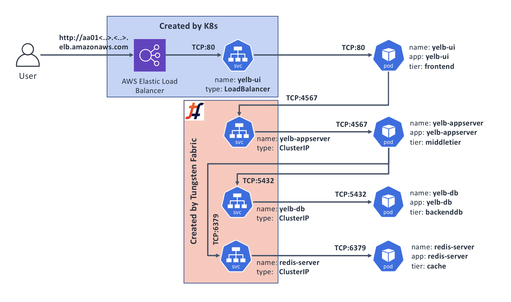
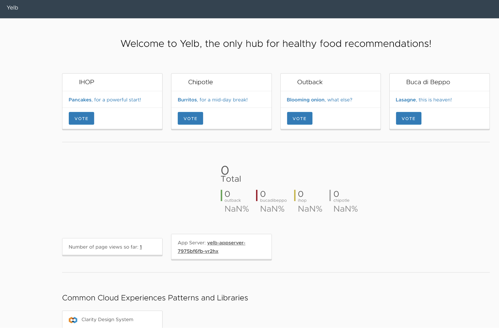

## Use case 1: Basic app connectivity through Kubernetes' Services

This is the most [basic and fundamental functionality](https://kubernetes.io/docs/concepts/services-networking/connect-applications-service/) that all Kubernetes CNI plugins provide. Application Pods need to be able to talk to each other, and Kubernetes Services are the way to ensure that it is possible with Pods coming and going with time to support application scale and availability.

### When would I care?

All major CNI plugins provide basic Pod to Pod connectivity, as well as some of the Service types, such as `ClusterIP`.

In addition to that, Tungsten Fabric comes with out of the box support of Service type `LoadBalancer`. When running on AWS, using `LoadBalancer` Service in your manifest creates a public-facing AWS ELB, making your application available from the Internet in one step.

This also means you can use the Kubernetes deployment manifest for your application unchanged in all places where Tungsten Fabric with Kubernetes is available - on premises and in all major public clouds.

### Deployments

When you create a Deployment, a CNI works in concert with Kubernetes to allocate network IP addresses for each of your application Pods, and "wire up" each pod to the cluster network.

> Note: most CNIs work by creating an `overlay network` that in most cases is contained within the boundaries of a single Kubernetes cluster. As the result, Pods in different clusters cannot communicate directly.
> 
> While we will not cover multi-cluster scenarios in this document, Tungsten Fabric is capable of supporting such configurations. A single installation of Tungsten Fabric can serve multiple Kubernetes clusters at the same time. In such scenario Pods from different clusters can communicate with each other directly, even if Kubernetes clusters themselves are in different locations.

### Services

[Services](https://kubernetes.io/docs/concepts/services-networking/service/) in Kubernetes are "an abstract way to expose an application running on a set of Pods". In most cases, a Service is a simple Round-Robin Load Balancer. It has a Virtual IP address ("VIP") for receiving network requests, and a zero or more Endpoint IP addresses that it will forward these requests to.

In most cases a Service will automatically discover Endpoint IP addresses that belong to the application Pods by looking for matching labels (called "Selectors") on running Pods.

### Sample app's Deployments and Services

Make sure you're on the sandbox control node, logged in as root, and in the correct directory:
```bash
# Make sure we're root
whoami | grep root || sudo -s

# Change to the manifests directory
cd /home/centos/yelb/deployments/platformdeployment/Kubernetes/yaml
```

Review the `cnawebapp-loadbalancer.yaml` file, looking for the sections that start with `Kind: Deployment` and `Kind: Service`
```bash
less cnawebapp-loadbalancer.yaml
```

(Use arrows / PgUp / PgDn to navigate; press `q` to exit)

Note that:

*   `spec.template.spec.containers.ports.containerPort` in Deployments shows what TCP port a Pod will listen to;
*   `spec.ports` in Services shows what port a Service's VIP will be listening to;
*   `spec.selector` in Services shows what labels on Pods a Service will look for to send traffic to.

Next, let's deploy our app and see what happens:

```bash
kubectl create -f cnawebapp-loadbalancer.yaml
```

This will create the following application topology:



If the application deploys without errors, we should be able to see that:

All Pods have their own IP address and are listening on their respective ports:
```text
kubectl get pods -o wide
NAME                             READY     STATUS    RESTARTS   AGE       IP              NODE
redis-server-5786bc9958-mkm6s    1/1       Running   0          9m        10.47.255.247   ip-172-25-1-190.us-west-1.compute.internal
yelb-appserver-7975bf6fb-xvzgh   1/1       Running   0          9m        10.47.255.248   ip-172-25-1-190.us-west-1.compute.internal
yelb-db-ccd4bd9f5-9pt9m          1/1       Running   0          9m        10.47.255.249   ip-172-25-1-79.us-west-1.compute.internal
yelb-ui-5cd947475f-dsvbd         1/1       Running   0          9m        10.47.255.250   ip-172-25-1-79.us-west-1.compute.internal
```

All Services have a VIP and a port they're listening on:
```text
kubectl get svc
NAME             TYPE           CLUSTER-IP       EXTERNAL-IP        PORT(S)        AGE
kubernetes       ClusterIP      10.96.0.1        <none>             443/TCP        4h
redis-server     ClusterIP      10.103.111.102   <none>             6379/TCP       9m
yelb-appserver   ClusterIP      10.109.212.183   <none>             4567/TCP       9m
yelb-db          ClusterIP      10.96.201.173    <none>             5432/TCP       9m
yelb-ui          LoadBalancer   10.108.170.55    aa01af9988cc3...   80:32393/TCP   9m
```

All Services have discovered their respective Endpoints:
```text
kubectl get ep
NAME             ENDPOINTS            AGE
kubernetes       172.25.1.105:6443    4h
redis-server     10.47.255.247:6379   10m
yelb-appserver   10.47.255.248:4567   10m
yelb-db          10.47.255.249:5432   10m
yelb-ui          10.47.255.250:80     10m
```

Since Tungsten Fabric provides support for Kubernetes Service type `LoadBalancer`, we should now be able to connect to our application from the Internet. Let's find out what the public DNS name for our load balancer is:
```text
# kubectl get svc yelb-ui -o wide
NAME      TYPE           CLUSTER-IP      EXTERNAL-IP                                                               PORT(S)        AGE       SELECTOR
yelb-ui   LoadBalancer   10.108.170.55   aa01af9988cc311e9badf06b57ebf630-1452353610.us-west-1.elb.amazonaws.com   80:32393/TCP   11m       app=yelb-ui,tier=frontend
```

We can see that our app is available on `aa01af9988cc311e9badf06b57ebf630-1452353610.us-west-1.elb.amazonaws.com`, so let's check it by pointing our web browser to it:



It worked!

### Cleanup

Once you've played with the app for a moment or two, feel free to undeploy it:
```bash
kubectl delete -f cnawebapp-loadbalancer.yaml
```

### Recap and what's next

In this Use Case, we've got our sample application deployed and available from the Internet using Tungsten Fabric Kubernetes CNI plugin and integration with AWS' Elastic Load Balancing.

Our sample application is on the web. If this is all we wanted - we are done. However, if we need things like SSL offload or want to send incoming requests to different application components based on HTTP host and/or path, we will need to use Kubernetes Ingress. The Use Case 2 covers this scenario.
