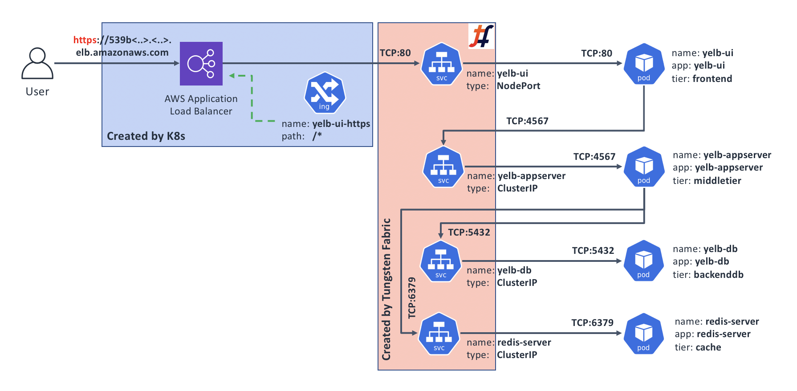
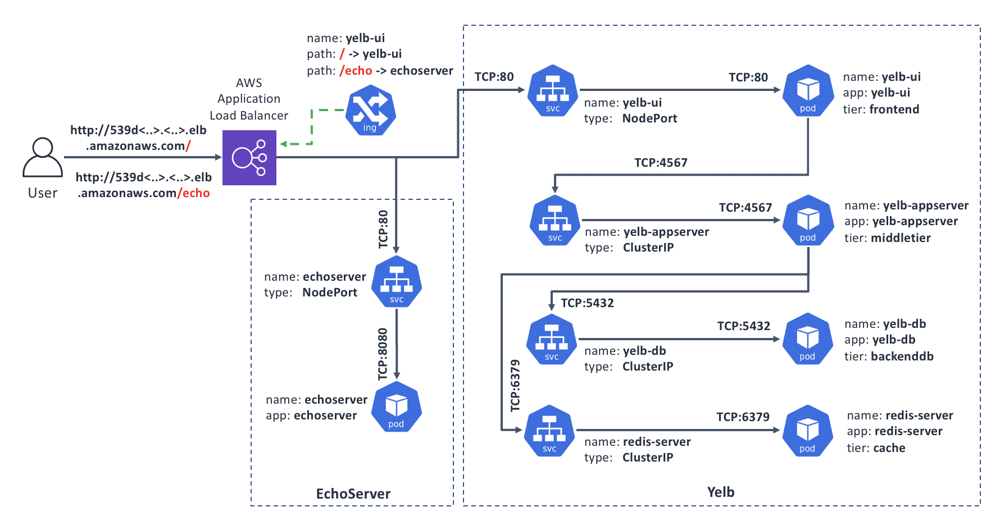
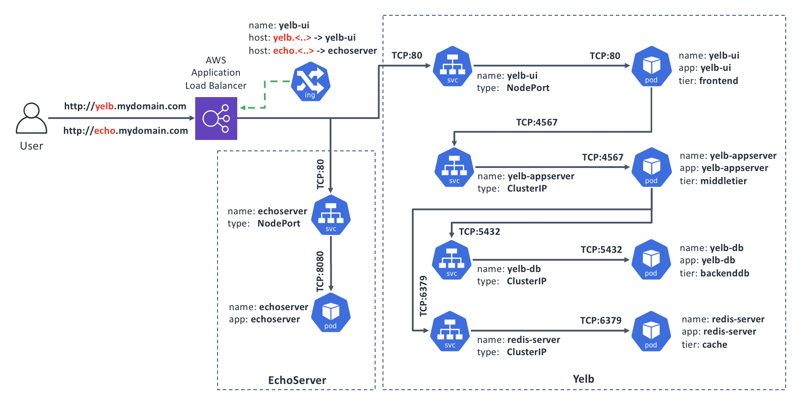

## Use case 2: Advanced external app connectivity through Kubernetes' Ingress

[Kubernetes documentation page on Ingress](https://kubernetes.io/docs/concepts/services-networking/ingress/) describes it as:

> "An API object that manages external access to the services in a cluster, typically HTTP.

> Ingress can provide load balancing, SSL termination and name-based virtual hosting."

Ingress functionality is not provided by CNI. This means that a Kubernetes cluster operator would typically have to install, and then manage and support a separate [Ingress controller solution](https://kubernetes.io/docs/concepts/services-networking/ingress-controllers/) for their cluster.

For Kubernetes deployments on premises and in public clouds where Kubernetes doesn't have built-in Ingress support, Tungsten Fabric comes bundled with its own Ingress controller. It uses HAProxy under the covers and implements all basic functionality as described in [Kubernetes Ingress documentation page](https://kubernetes.io/docs/concepts/services-networking/ingress/).

When running on AWS, Kubernetes can be [configured](https://aws.amazon.com/blogs/opensource/kubernetes-ingress-aws-alb-ingress-controller/) to use AWS's Application Load Balancer [(ALB) for its Ingress services](https://kubernetes-sigs.github.io/aws-alb-ingress-controller/guide/ingress/spec/). Kubernetes in this sandbox is set up this way, to most closely reflect a typical real life deployment scenario.

The following diagram outlines the resulting deployment architecture for our example application:


### When would I care?

Ingress controller option is only compatible with applications that use HTTP or HTTPS. If that's the case for your application, then you may want to consider Ingress to help you with the following:

*   You'd like to secure your application with HTTPS by exposing it through Ingress configured to perform SSL offload; and/or
*   You'd like to direct incoming requests to different Kubernetes Services based on HTTP path in requests, e.g., `/blog/` could go to `Service A`, while `/account/` could go to `Service B`, etc.; and/or
*   Your application serves multiple DNS domains through Name-based Virtual Hosting, e.g., requests with the `Host:` header set to `test.project.com` need to go to `Service C`, while ones with `prod.project.com` need to go to `Service D`.

### Exposing our sample app through Ingress

Before we explore the three scenarios above, let's deploy our sample application with a simple Ingress similar to how we did it with Service type `LoadBalancer`, and then build on that.

Make sure you're on the sandbox control node, logged in as root, and in the correct directory:
```bash
# Make sure we're root
whoami | grep root || sudo -s

# Change to the manifests directory
cd /home/centos/yelb/deployments/platformdeployment/Kubernetes/yaml

# Deploy our sample application with Ingress
kubectl create -f cnawebapp-ingress-alb.yaml
```

After a couple of minutes, deployment process should complete and we should be able to access our sample application from the Internet. Let's find the DNS name for our Ingress:
```text
# kubectl get ing yelb-ui
NAME      HOSTS   ADDRESS                                                               PORTS   AGE
yelb-ui   *       539db10e-default-yelbui-3c9c-1330819777.us-west-1.elb.amazonaws.com   80      60m
```

According to the output above, our sample app is now available from the Internet on http://539db10e-default-yelbui-3c9c-1330819777.us-west-1.elb.amazonaws.com

Try accessing Yelb through the DNS name you've got when you ran the command above in your environment, to make sure it works.

### Securing our sample app with HTTPS

For this exercise, we'll need to generate and add a self-signed certificate to the AWS Certificate Manager. AWS Application Load Balancer (ALB) that serves the Ingress function needs this to perform the encryption.

> Note: for production use, you will likely need to get a "proper" certificate for a fully registered domain name, probably through the respective function of the AWS Certificate Manager. Since we're just doing an exercise, we'll go with a self-signed one and a made-up domain.

#### Step 1: Generate a self-signed certificate and add it to AWS Certificate Manager

> The steps below should be executed on a host where you have installed AWS CLI tool with Access and Secret keys that allow you to make changes to Certificate Manager.

```bash
# Generate self-signed certificate for a fake domain ‘yelb.mydomain.com':
openssl req -x509 -nodes -days 365 -newkey rsa:2048 -keyout tls.key -out tls.crt -subj "/CN=yelb.mydomain.com"

# Add our new certificate to the AWS Certificate Manager
# Pay attention to the "--region" - it must be the same AWS region
# where you're running Tungsten sandbox; in our example it is "us-west-1"
aws acm import-certificate --certificate file://tls.crt --private-key file://tls.key --region us-west-1
```

If all went well, the last command will display something similar to the following:
```text
{
    "CertificateArn": "arn:aws:acm:us-west-1:180612498884:certificate/e7341ff5-52ef-4a7b-94b5-05643ef6ab46"
}
```

We will need the value that follows the `CertificateArn` for our next step.

#### Step 2: Create our Ingress definition

Make sure you're on the sandbox control node, logged in as root, and in the correct directory:
```bash
# Make sure we're root
whoami | grep root || sudo -s

# Change to the manifests directory
cd /home/centos/yelb/deployments/platformdeployment/Kubernetes/yaml
```

Now, let's create a new Ingress definition:
```bash
cat > ingress-https.yaml <<EOF
apiVersion: extensions/v1beta1
kind: Ingress
metadata:
  name: "yelb-ui-https"
  annotations:
    kubernetes.io/ingress.class: alb
    alb.ingress.kubernetes.io/scheme: internet-facing 
    alb.ingress.kubernetes.io/listen-ports: '[{"HTTPS":443}]'
    alb.ingress.kubernetes.io/certificate-arn: INSERT_CERT_ARN_HERE
  labels:
    app: "yelb-ui"
spec:
  rules:
  - host: yelb.mydomain.com
    http:
      paths:
      - path: /*
        backend:
          serviceName: "yelb-ui"
          servicePort: 80
EOF
```

Next, let's put the `CertificateArn` in. Edit the command before running it, and replace the `arn:aws:acm:us-west-1:180612498884:certificate/e7341ff5-52ef-4a7b-94b5-05643ef6ab46` with the value for `CertificateArn` that you got when you executed the Step 1 above.
```bash
sed -i "s#INSERT_CERT_ARN_HERE#arn:aws:acm:us-west-1:180612498884:certificate/e7341ff5-52ef-4a7b-94b5-05643ef6ab46#" ingress-https.yaml
```

If the command ran successfully, your `ingress-https.yaml` file will have the ARN of your self-signed certificate instead of the string `INSERT_CERT_ARN_HERE`.

#### Step 3: Create the HTTPS Ingress and test it
```bash
# Create a new Ingress
kubectl create -f ingress-https.yaml
```

After running the command above, wait for a couple minutes for the new ALB Ingress to come up. Then, let's find what DNS name has been assigned to it, and try connecting to it:
```text
# kubectl get ingress yelb-ui-https
NAME            HOSTS                ADDRESS                                                                  PORTS   AGE
yelb-ui-https   yelb.mydomain.com    539db10e-default-yelbuihtt-2a0d-1983111448.us-west-1.elb.amazonaws.com   80      16m
```

From the output above, we can see the ADDRESS of the new Ingress; let's see if it worked:
```text
# curl -v -k https://539db10e-default-yelbuihtt-2a0d-1983111448.us-west-1.elb.amazonaws.com -H "Host: yelb.mydomain.com"

[..skip..]

* SSL connection using TLS_ECDHE_RSA_WITH_AES_128_GCM_SHA256
* Server certificate:
* 	subject: CN=yelb.mydomain.com

[..skip..]

<html>
<head>
    <script src="env.js"></script>
    <meta charset="utf-8">
    <title>Yelb</title>
    <base href="/">
    <meta name="viewport" content="width=device-width, initial-scale=1">
    <link rel="icon" type="image/x-icon" href="favicon.ico?v=2">
</head>
<body>
<yelb>Loading...</yelb>

[..skip..]
```

It worked - we can access the Yelb application over an encrypted connection!

Our new topology looks something like this (note that we still have our original HTTP Ingress that isn't shown on this diagram):



#### Summary: why would I want this?

There are a few benefits to implementing HTTPS Ingress, in addition to added end-user's connection security, privacy, and data integrity:

*   Your application consumes less compute resources, since the encryption overheads are transferred to the ALB;
*   Your application now supports HTTP/2, which is a [good thing](https://searchengineland.com/everyone-moving-http2-236716);
*   You can also easily implement [automatic redirect](https://kubernetes-sigs.github.io/aws-alb-ingress-controller/guide/tasks/ssl_redirect/) of HTTP to HTTPS.

#### Cleanup

Let's delete the HTTPS Ingress that we've added as we don't need it for the rest of this chapter:
```bash
kubectl delete -f ingress-https.yaml
```

Then, from the computer where you performed the Step 1 (generate and install self-signed certificate into the AWS Certificate Manager), run the following command to delete that certificate, making sure you use your own value of the `CertificateArn`:
```bash
aws acm delete-certificate --certificate-arn arn:aws:acm:us-west-1:180612498884:certificate/e7341ff5-52ef-4a7b-94b5-05643ef6ab46
```

### Directing requests based on URL path

In some cases you may want to run more than one application off the same DNS domain name; for example `www.corp.com` may support your main application, while some other application like WordPress could be handling `www.corp.com/blog`.

For this exercise, we are assuming that you have a copy of Yelb running per instructions at the start of this chapter in "Exposing our sample app through Ingress". If you're starting fresh, jump up to that part, follow the instructions to deploy, and come back.

To demonstrate the routing by the URL Path, we will add another Deployment to our environment, and update the configuration of our Ingress accordingly. With this new configuration our Ingress will direct requests for the `/` path to our main app `yelb`, while requests for the `/echo` path will go to the new app, `EchoServer`.

Here's a diagram of our target state:



We should already have the `Yelb` part in place, so let's add the `EchoServer`:
```bash
# Create the EchoServer Deployment and Service manifest:
cat > echoserver.yaml << EOF
apiVersion: extensions/v1beta1
kind: Deployment
metadata:
  name: echoserver
spec:
  replicas: 1
  template:
    metadata:
      labels:
        app: echoserver
    spec:
      containers:
      - image: gcr.io/google_containers/echoserver:1.4
        name: echoserver
        ports:
        - containerPort: 8080
---
apiVersion: v1
kind: Service
metadata:
  name: echoserver
spec:
  ports:
    - port: 80
      targetPort: 8080
      protocol: TCP
  type: NodePort
  selector:
    app: echoserver
EOF

# And now deploy it:
kubectl create -f echoserver.yaml
```

Next, we'll create an updated configuration for our Ingress. To do this, we'll copy the Ingress resource from the `cnawebapp-ingress-alb.yaml` and make two changes in the routing part:

1. Update the Path to `yelb` from `/*` to `/` so that it doesn't interfere with the `echoserver`; and
2. Add a new `/echo` Path leading to the `echoserver`

Note: the reason we're including the full resource definition instead of just applying the difference is that `Ingress` objects don't support strategic merge patching.

```bash
# Our updated Ingress resource:
cat > ingress-paths.yaml << EOF
apiVersion: extensions/v1beta1
kind: Ingress
metadata:
  name: "yelb-ui"
  annotations:
    kubernetes.io/ingress.class: alb 
    alb.ingress.kubernetes.io/scheme: internet-facing 
  labels:
    app: "yelb-ui"
spec:
  rules:
    - http:
        paths:
          - path: /
            backend:
              serviceName: "yelb-ui"
              servicePort: 80
          - path: /echo
            backend:
              serviceName: "echoserver"
              servicePort: 80
EOF

# And now deploy it:
kubectl apply -f ingress-paths.yaml 
```

There will be a warning about the `kubectl apply` which is safe to ignore in our case since our updated resource is essentially the same save the `rules` configuration.

Once the updated configuration becomes active in a few seconds, we can check if the URL-based routing works. When we request the base URL `/` (or empty), we should get to `Yelb`, and if we request `/echo`, we should get back output of the `EchoServer`.

```bash
# Get the base URL of our Ingress
baseUrl=$(kubectl get ing yelb-ui | grep amaz | awk '{print $3}')
echo "Our Ingress is at: ${baseUrl}"

# Try to access the $baseUrl ; we should get back our Yelb UI page contents
curl http://${baseUrl}

# Now try /echo ; we should get back the output of the EchoServer
curl http://${baseUrl}/echo
```

### Serving multiple DNS domains

The solution in this scenario is useful when you have multiple domain names and would like to serve different applications from each domain while sharing the same Ingress infrastructure. This helps save costs and in some cases may be less complex than having dedicated Ingress instances per domain name.

This exercise builds on the previous one, `Directing requests based on URL path`. If you have not completed it, please go up and simply cut and paste the steps that create and deploy the `echoserver.yaml` manifest. We will build a new one for the Ingress, so no need to create and deploy the `ingress-paths.yaml`.

Once ready, you should have: a copy of `yelb` and a copy of `echoserver`. It doesn't matter what your Ingress configuration is as we're going to overwrite it.

In our target state, Ingress will have two domain names defined, `yelb.mydomain.com` and `echo.mydomain.com`, and will route the incoming requests according to the value in the `Host:` HTTP header, which web browsers insert automatically for the host portion of the URL that you request.

Here's the diagram of our target state:



Let's create and deploy the configuration for our Ingress that will do the required routing:
```bash
# Our updated Ingress resource:
cat > ingress-hosts.yaml << EOF
apiVersion: extensions/v1beta1
kind: Ingress
metadata:
  name: "yelb-ui"
  annotations:
    kubernetes.io/ingress.class: alb 
    alb.ingress.kubernetes.io/scheme: internet-facing 
  labels:
    app: "yelb-ui"
spec:
  rules:
    - host: yelb.mydomain.com
      http:
        paths:
          - path: /*
            backend:
              serviceName: "yelb-ui"
              servicePort: 80
    - host: echo.mydomain.com
      http:
        paths:
          - path: /*
            backend:
              serviceName: "echoserver"
              servicePort: 80
EOF

# And now deploy it:
kubectl apply -f ingress-hosts.yaml 
```

Once the configuration successfully applies, we're ready to test. Since the domain name and hosts are made up, we will ask `curl` to add a correct `Host:` header. When it is set to `yelb.mydomain.com` we should get to `Yelb`, and when it's set to `echo.mydomain.com`, we should get back output of the `EchoServer`.

```bash
# Get the base URL of our Ingress
baseUrl=$(kubectl get ing yelb-ui | grep amaz | awk '{print $3}')
echo "Our Ingress is at: ${baseUrl}"

# Access our Ingress with Host: set to yelb; we should get back our Yelb UI page contents
curl http://${baseUrl} -H "Host: yelb.mydomain.com"

# Now try Host: set to echo; we should get back the output of the EchoServer
curl http://${baseUrl} -H "Host: echo.mydomain.com"
```

### Cleanup

Once you've explored enough, feel free to clean things up:
```bash
# Delete the "yelb" and "echoserver" applications:
kubectl delete -f cnawebapp-ingress-alb.yaml
kubectl delete -f echoserver.yaml

# Delete the additional manifests we've created:
rm -f echoserver.yaml ingress-paths.yaml ingress-hosts.yaml
```

### Recap and what's next

Kubernetes provides three basic ways of exposing an application to the outside world: Services of type `LoadBalancer` or `NodePort`, and Ingress. The first two support any arbitrary protocols, but also don't add much in the sense of protocol intelligence. Ingress, on the other hand, provides protocol-specific functions, but that makes it compatible only with applications that use HTTP or HTTPS.

Similar to other features, Kubernetes requires a controller to implement the actual Ingress functionality - simply creating `Ingress` resources in Kubernetes API doesn't do anything. Ingress controllers are pieces of software that Kubernetes cluster operators have to install and then monitor, patch, upgrade, etc.. Tungsten Fabric comes bundled with an Ingress controller which should make this process easier.

Once you've determined how your application should be exposed to the Internet, you need to consider how to deal with the questions around network access controls. Read on Use Cases 3 and 4 in this guide where we cover some of these scenarios.
