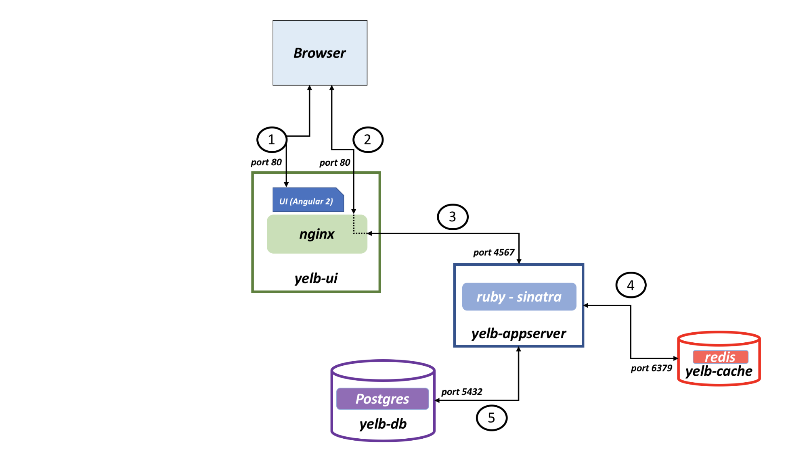
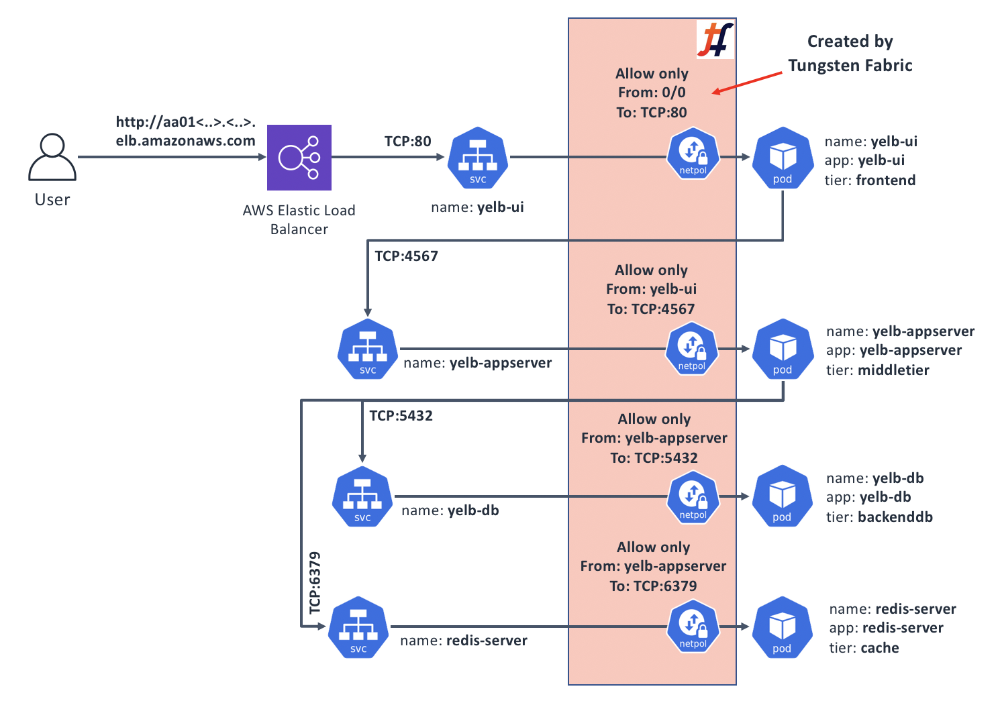
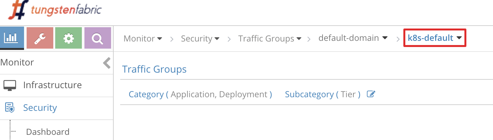

## Use case 4: Application micro-segmentation through Kubernetes Network Policies

In most production environments there is a need to implement network access controls. Kubernetes [provides a way](https://kubernetes.io/docs/concepts/services-networking/network-policies/) to describe how groups of Pods should be able to communicate by using NetworkPolicy resources.

As with most things in Kubernetes, for Network Policies to work, you need a Kubernetes CNI plugin that supports them.

### When would I care?

Setting up explicit rules for what components of your application should be able to communicate is generally a good idea in almost all circumstances. [Kubernetes Network Policy](https://kubernetes.io/docs/concepts/services-networking/network-policies/) specification is a straight-forward way of doing that that lets you integrate `NetworkPolicy` definitions directly with your application manifest.

The way `NetworkPolicy` resources are defined lets you be both precise in specifying what is network communications are permitted and what are not, and at the same time deal with the dynamic nature of applications running on Kubernetes by using `podSelector` definitions.

This means your policies can target individual Pods or Pod groups, "shrinking" your security perimeter down to the size of a Pod.

A tightly defined Network Policy combined with the `default-deny` configuration can save a lot of headaches from the effects of malicious application compromises, and/or misbehaving or misconfigured applications. For example, an application component may have a stuck cached DNS entry or a wrong configuration parameter causing it to talk to wrong backend. Or an application may get compromised and used as a beachhead to perform reconnaissance, attempt lateral movement, or simply use [Pod's access to Kubernetes API](https://kubernetes.io/docs/tasks/access-application-cluster/access-cluster/#accessing-the-api-from-a-pod) to launch some crypto-miner pods to steal your compute resources.

### Securing our sample app with Network Policies

The topic of Network Policy design is significantly larger than the space in this guide allows. In this example we will do the following:

*   Create a `default-deny` Ingress policy for our `default` Namespace. This means all incoming connections to Pods running in this Namespace will have to explicitly allowed to work; and
*   Create an Ingress `NetworkPolicy` objects for each of our sample application's components, allowing only what we are certain should be allowed.

#### Step 1: figure out what should be able to talk to what

First, we will need to remind ourselves how components of our application are expected to communicate. For that we'll go back to our app's diagram that we've seen in the introduction:



From this diagram, we see that:

1. The outside world will need to reach `yelb-ui` on TCP port 80 - (1) and (2)
2. `yelb-ui` needs to reach `yelb-appserver` on TCP port 4567
3. `yelb-appserver` than in turn will need to reach `yelb-db` on TCP port 5432, and
4. ..`yelb-cache` on TCP port 6379.

#### Step 2: how do we identify our components?

Remember that `NetworkPolicy` resources use Selectors to identify which Pods a policy applies to, and what are the source and destination of traffic that policy will govern.

For this exercise, we will use `podSelectror` method, so we'll need to get a list of labels applied to our application Pods. Let's look through the `cnawebapp-loadbalancer.yaml` manifest for our sample app, and collect the labels:

| Pod | Labels |
| :-- | :-- |
| yelb-ui | app: yelb-ui <br> tier: frontend |
| yelb-appserver | app: yelb-appserver <br> tier: middletier |
| yelb-db | app: yelb-db <br> tier: backenddb |
| redis-server | app: redis-server <br> tier: cache |

We are now ready to write our policies.

These policies, once deployed, will control the communications between our app's components in the following manner:



#### Step 3: A "default-deny" Policy

Make sure you're on the sandbox control node, logged in as root, and in the correct directory:
```bash
# Make sure we're root
whoami | grep root || sudo -s

# Change to the manifests directory
cd /home/centos/yelb/deployments/platformdeployment/Kubernetes/yaml
```

In this step, we'll create a Policy that will prevent all network communications that aren't explicitly allowed. We'll stick to only restricting `Ingress` traffic; but in practice you may want to do that for `Egress` as well (but watch out for blocking DNS queries when doing so!):
```bash
cat > yelb-policy.yaml <<EOF
# First, add Ingress default-deny
#
apiVersion: networking.k8s.io/v1
kind: NetworkPolicy
metadata:
  name: default-deny
spec:
  podSelector: {}
  policyTypes:
  - Ingress
EOF
```

This policy basically says: "for any Pods, apply an `Ingress` Policy that has no rules" which will result in all incoming traffic to all Pods in the Namespace where this Policy is applied to be dropped.

#### Step 4: A Policy for "yelb-ui"

The `yelb-ui` is slightly different from the other components in the sense that it's the only one that gets accessed from the outside, therefore its `ingress:` definition will use `ipBlock` of `0.0.0.0/0` to signify "Everyone":
```bash
cat >> yelb-policy.yaml <<EOF
---
# Policy to let anyone reach yelb-ui
apiVersion: networking.k8s.io/v1
kind: NetworkPolicy
metadata:
  name: yelb-ui-in
spec:
  podSelector:
    matchLabels:
      app: yelb-ui
      tier: frontend
  policyTypes:
  - Ingress
  ingress:
  - from:
    - ipBlock:
        cidr: 0.0.0.0/0
    ports:
    - protocol: TCP
      port: 80
EOF
```

This Policy says: "for Pods with Labels of `app: yelb-ui` and `tier: frontend`, allow incoming traffic from any source IP as long as it's going to the Pod's TCP port 80".

#### Step 5: Policies for the rest of Pods in our sample app

The other 3 Pods in our sample app will only see traffic from other Pods, so their policies will use the `podSelector` parameter with labels of Pods that are allowed to send traffic:
```bash
cat >> yelb-policy.yaml <<EOF
---
# Policy to let yelb-ui reach yelb-appserver
apiVersion: networking.k8s.io/v1
kind: NetworkPolicy
metadata:
  name: yelb-appserver-in
spec:
  podSelector:
    matchLabels:
      app: yelb-appserver
      tier: middletier
  policyTypes:
  - Ingress
  ingress:
  - from:
    - podSelector:
        matchLabels:
          app: yelb-ui
          tier: frontend
    ports:
    - protocol: TCP
      port: 4567
---
# Policy to let yelb-appserver reach yelb-db
apiVersion: networking.k8s.io/v1
kind: NetworkPolicy
metadata:
  name: yelb-db-in
spec:
  podSelector:
    matchLabels:
        app: yelb-db
        tier: backenddb
  policyTypes:
  - Ingress
  ingress:
  - from:
    - podSelector:
        matchLabels:
          app: yelb-appserver
          tier: middletier
    ports:
    - protocol: TCP
      port: 5432
---
# Policy to let yelb-appserver reach redis-server
apiVersion: networking.k8s.io/v1
kind: NetworkPolicy
metadata:
  name: redis-server-in
spec:
  podSelector:
    matchLabels:
        app: redis-server
        tier: cache
  policyTypes:
  - Ingress
  ingress:
  - from:
    - podSelector:
        matchLabels:
          app: yelb-appserver
          tier: middletier
    ports:
    - protocol: TCP
      port: 6379
EOF
```

#### Step 6: Let's test how things work before applying the Policy

So that we have a "before and after", let's deploy our sample app and capture a baseline:
```bash
# Deploy our app
kubectl create -f cnawebapp-loadbalancer.yaml
```

Wait for the app to come up and become available externally:
```bash
# Get an external DNS name of our app's yelb-ui Service:
kubectl get svc -o wide | grep yelb-ui | awk '{print $4}'
```

We should get back something like `a0b8dfc14916811e9b411026463a4a33-1258487840.us-west-1.elb.amazonaws.com`; open it in your web browser; sample application should load.

Next, we know that all Pod communications are unrestricted, so we should be able to ping from say `yelb-ui` to `yelb-db` - an activity that should not really happen when an application is running normally and we're not troubleshooting:
```bash
# Get the full Pod name for "yelb-ui"
src_pod=$(kubectl get pods | grep yelb-ui | awk '{print $1}')

# Get an IP of the "yelb-db":
db_pod_ip=$(kubectl get pods -o wide | grep yelb-db | awk '{print $6}')

# Run a ping command from "yelb-ui" to "yelb-db":
kubectl exec -it ${src_pod} ping ${db_pod_ip}
```

We should see that the `ping` command is receiving responses; so there is an unrestricted network connectivity present. Press ^C to stop the command.

#### Step 7: Deploying the policy and testing the results

In this last step, we'll deploy our Policy and observe the effects:
```bash
# Deploy the Network Policy
kubectl create -f yelb-policy.yaml
```

After running the command above, give it a few seconds to settle down. Tungsten Fabric will generate appropriate Security Groups in the background, and install them. Let's test if our ping command that worked just now still does:

```bash
# Run a ping command from "yelb-ui" to "yelb-db" again:
kubectl exec -it ${src_pod} ping ${db_pod_ip}
```

This time, we see that there are no responses, since the communications are now blocked by the policy. Next, test if the app is still accessible from your web browser - it should be!

#### Bonus step 8: explore Tungsten Fabric's Security Traffic Group visualisation

Tungsten Fabric includes a function that visualised traffic flows in a "project" which in our case corresponds to the Kubernetes `Namespace`.

To access it, follow the link on the `Carbide Evaluation Page` that you used to get access to the sandbox control node - at the top there is a link to `Contrail UI`, along with `login` and `password`. Follow the link, then in the top left corner click "Monitor" icon, followed by "Security" -> "Traffic Groups" in the menu. Then follow the crumb trail at the top and select "k8s-default" at the end of it:



You should see a diagram similar to the below:


Explore around; the flows that you see represent what our sample app does, including our unsuccessful attempt to ping from `yelb-ui` to `yelb-db`, and the fact that `yelb-appserver` makes outbound requests (which, if we go and investigate, turns out to be DNS queries for `yelb-db`).

### Cleanup

Once you've explored enough, feel free to clean things up:
```bash
# Undeploy the Network Policy
kubectl delete -f yelb-policy.yaml

# Delete our sample app:
kubectl delete -f cnawebapp-loadbalancer.yaml

# Delete the Policy Manifest:
rm -f yelb-policy.yaml
```

### Recap and what's next

The ability to control application's network communications is crucial for many if not all production deployments. The way to implement such controls for applications running on Kubernetes is through `NetwokPolicy` resources; however for these resources to actually work you need a CNI plugin that supports them.

Tungsten Fabric includes full support for `NetworkPolicy`, irrespective of where your Kubernetes cluster with Tungsten Fabric is running - in your private DC, or in a public cloud.

Network Policies could be made very simple or very complex, and the best way to figure out what's best for your application is to dive deeper into use cases and examples on top of what we've provided. Here are a few resources that may help:

*   [Good detailed introduction](https://medium.com/@reuvenharrison/an-introduction-to-kubernetes-network-policies-for-security-people-ba92dd4c809d) to Network Policies
*   [A nice GitHub repository](https://github.com/ahmetb/kubernetes-network-policy-recipes) with many examples of well-documented Network Policy manifests
*   A talk at 2019 Kubecon with a good section on strategies for Network Policies: [https://youtu.be/_VNv7jBh1XA?t=1273](https://youtu.be/_VNv7jBh1XA?t=1273)

When dealing with controlling network traffic flows, we also need an ability to see them. We've briefly touched on some of the Tungsten Fabric's visibility tools in our Bonus stet 8 above, and will explore this area in more detail in our Use case 5.
