## Tungsten Fabric Architecture

### Detailed Technical Description of the Virtual Networking and Security Platform


**[介绍](#introduction)**  
&nbsp;&nbsp;&nbsp;&nbsp;
_[用例](#use-cases)_  
&nbsp;&nbsp;&nbsp;&nbsp;
_[Tungsten Fabric主要特点 ](#key-features)_  

**[Tungsten Fabric怎么运作](#how-tf-works)**  
&nbsp;&nbsp;&nbsp;&nbsp;
_[Tungsten Fabric支持Orchestrator](#tf-with-orchestrator)_  
&nbsp;&nbsp;&nbsp;&nbsp;
_[和Orchestrator的互动](#working-with-orchestrator)_  

**[vRouter架构解说](#vrouter-details)**  
&nbsp;&nbsp;&nbsp;&nbsp;
  _[详细的vRouter封包处理逻辑](#packet-processing)_  
&nbsp;&nbsp;&nbsp;&nbsp;
  _[相同子网虚拟机之间封包流](#packet-flow-same-subnet)_  
&nbsp;&nbsp;&nbsp;&nbsp;
  _[不同子网虚拟机之间封包流](#packet-flow-different-subnet)_  
  
**[服务链](#service-chains)**   
&nbsp;&nbsp;&nbsp;&nbsp;
  _[基本服务链](#basic-service-chain)_  
&nbsp;&nbsp;&nbsp;&nbsp;
  _[扩展性服务](#scaled-out-service)_  
&nbsp;&nbsp;&nbsp;&nbsp;
  _[基于策略的流转向](#policy-based-steering)_  
  
**[基于应用程序的安全策略](#application-policies)**  
&nbsp;&nbsp;&nbsp;&nbsp;
  _[创建应用程序策略](#creating-policy)_  
&nbsp;&nbsp;&nbsp;&nbsp;
  _[控制部署之间的流](#flows-between-deployment)_  
&nbsp;&nbsp;&nbsp;&nbsp;
  _[高级应用策略](#advanced-policies)_  
  
**[vRouterd的部署选项](#vrouter-deployment-options)**  
&nbsp;&nbsp;&nbsp;&nbsp;
  _[内核模块的vRouter](#kernel-module-vrouter)_  
&nbsp;&nbsp;&nbsp;&nbsp;
  _[DPDK vRouter](#dpdk-vrouter)_  
&nbsp;&nbsp;&nbsp;&nbsp;
  _[SR-IOV (單一根I/O 虛擬化)](#sriov-vrouter)_  
&nbsp;&nbsp;&nbsp;&nbsp;
  _[智能网卡的vRouter](#smartnic-vrouter)_  
  
**[Tungsten Fabric的收集和分析](#tf-analytics)**  

**[Tungsten Fabric的部署](#tf-deployment)**  

**[Tungsten Fabric APIs](#tf-apis)**  
&nbsp;&nbsp;&nbsp;&nbsp;
  _[控制器配置 REST API](#tf-rest-apis)_  
&nbsp;&nbsp;&nbsp;&nbsp;
  _[Python语言的绑定](#tf-python)_  
&nbsp;&nbsp;&nbsp;&nbsp;
  _[分析的REST API](#tf-analytics-rest-api)_  
  
**[Orchestrators](#tf-orchestrators)**  
&nbsp;&nbsp;&nbsp;&nbsp;
  _[OpenStack使用Tungsten Fabric](#tf-openstack)_  
&nbsp;&nbsp;&nbsp;&nbsp;
  _[Kubernetes容器使用Tungsten Fabric](#tf-kubernetes)_  
&nbsp;&nbsp;&nbsp;&nbsp;
  _[Tungsten Fabric 和 VMware vCenter](#tf-vcenter)_  
&nbsp;&nbsp;&nbsp;&nbsp;
  _[嵌套 Kubernetes with OpenStack or vCenter](#tf-nested-kubernetes)_  
  
**[连接到物理网络](#tf-physical)**  
&nbsp;&nbsp;&nbsp;&nbsp;
  _[启用BGP的网关](#tf-bgp-gateway)_  
&nbsp;&nbsp;&nbsp;&nbsp;
  _[源NAT](#tf-source-nat)_  
&nbsp;&nbsp;&nbsp;&nbsp;
  _[在底层网络(Underlay)中的路由](#tf-underlay-routing)_


## 介绍 {#introduction}

本文档介绍了Tungsten Fabric如何提供可扩展的虚拟网络平台，该平台可与各种虚拟机和容器协调器配合使用，并可与物理网络和计算基础架构集成。 Tungsten Fabric使用网络行业标准（如BGP EVPN控制平面和VXLAN覆盖）来无缝连接不同协调器域中的工作负载。 例如。 由VMware vCenter管理的虚拟机和由Kubernetes管理的容器。

随着虚拟化成为提供公共云和私有云服务的关键技术，迄今为止广泛使用的虚拟化技术（例如，使用L2网络的VMware，以及OpenStack的Nova，Neutron或ML2网络），网络规模问题日益明显。 Tungsten Fabric提供高度可扩展的虚拟网络平台，旨在支持最大环境中的多租户网络，同时支持多个协调器。

由于很少有数据中心部署是真正的“绿场”，因此几乎总是要求将部署在新基础架构上的工作负载与之前部署的工作负载和网络相集成。 本文档描述了一组部署方案，其中将部署新的云基础架构，并且还需要与现有基础架构共存。

### 用例 {#use-cases}

本文档包含以下常见用例:

*   在OpenStack管理的数据中心中实现具有高可扩展性和灵活性的平台即服务和软件即服务
*   使用Kubernetes容器管理系统的虚拟网络，包括Red Hat OpenShift
*   允许运行VMware vCenter的新的或现有的虚拟化环境在虚拟机之间使用Tungsten Fabric虚拟网络
*   直接通过数据中心底层网络使用BGP peering和网络覆盖与网关路由器将Tungsten Fabric虚拟网络连接到物理网络。

这些用例可以任意组合部署，以满足各种部署方案中的特定要求。 Tungsten Fabric的主要特征如下所示。


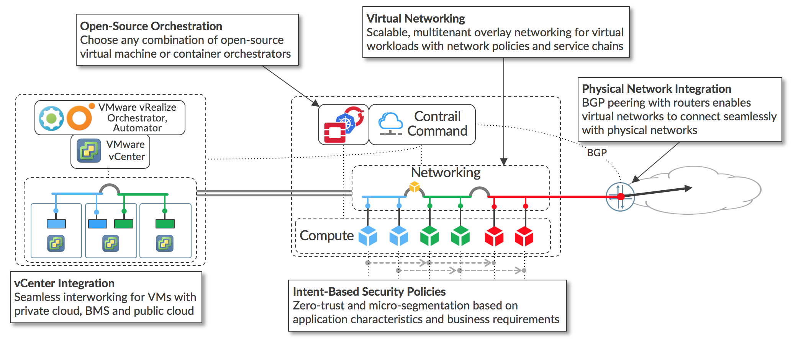


支持主要用例的关键功能是:

*   虚拟网络使用虚拟主机之间的封装隧道
*   用于虚拟机和容器的开源协调器的插件
*   基于标签的基于应用程序的安全策略
*   与VMware业务流程堆栈集成
*   使用BGP，SNAT和底层网络连接到外部网络.

由于在每个实现中都使用相同的控制器和转发组件，因此Tungsten Fabric提供了一致的界面来管理其支持的所有环境中的连接，并且能够在不同的协调器（无论是虚拟机还是容器）管理的工作负载之间提供无缝连接，以及 到外部网络的目的地。


### Tungsten Fabric主要特点 {#key-features}

Tungsten Fabric使用OpenStack和Kubernetes协调器在云环境中管理和实施虚拟网络。 Tungsten Fabric在每台主机上运行的vRouters之间使用覆盖网络。 它基于成熟的和标准的网络技术，如今支持世界主要服务提供商的广域网，但重新用于数据中心的虚拟化工作负载和云自动化，范围从大型企业数据中心到 较小的电信公司POPs。 它在协调器的本机网络实现上提供了许多增强功能，包括：


*   高度可扩展的多租户网络
*   多租户IP地址管理
*  DHCP，ARP代理，以避免泛滥到网络
*   广播和多播流量的高效边缘复制
*   本地，每个租户的DNS解析
*   带访问控制列表的分布式防火墙
*   基于应用程序的安全策略
*  跨主机的分布式负载平衡
*   网络地址转换（1：1浮动IP和分布式SNAT）
*   使用服务链接进行虚拟网络功能
*   IPv4和IPv6双栈支持
*   BGP与网关路由器对等
*   BGP即服务（BGPaaS），用于在私有管理的客户网络和服务提供商网络之间分配路由

以下部分详细描述了控制器如何与协调器和vRouters交互，以及如何在vRouter中实现和配置上述功能。


## Tungsten Fabric怎么运作 {#how-tf-works}

本节介绍Tungsten Fabric控制器和vRouter的软件体系结构，它在每个主机中转发封包，并描述虚拟机或容器启动时vRouters与Tungsten Fabric控制器之间的交互，然后相互交换封包。


### Tungsten Fabric支持Orchestrator {#tf-with-orchestrator}

Tungsten Fabric控制器集成了OpenStack或Kubernetes等云管理系统。 其功能是确保在创建虚拟机（VM）或容器时，根据控制器或协调器中指定的网络和安全策略为其提供网络连接。

Tungsten Fabric由两个主要软件组成
*   _Tungsten Fabric 控制器_– 一组维护网络和网络策略模型的软件服务，通常在多个服务器上运行以实现高可用性
*   _Tungsten Fabric vRouter_– 安装在运行工作负载（虚拟机或容器）的每个主机上，vRouter执行封包转发并实施网络和安全策略。

Tungsten Fabric的典型部署如下所示.

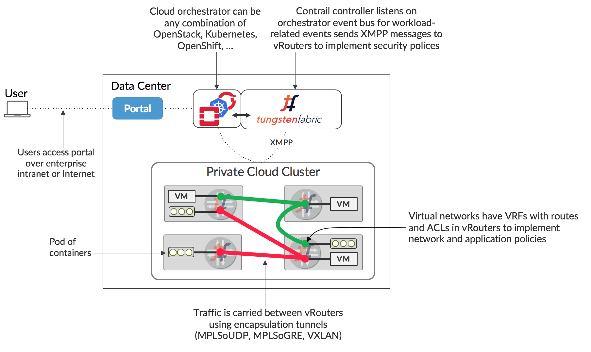

Tungsten Fabric控制器通过软件插件与协调器集成，该插件实现了协调器的网络服务。 例如，OpenStack的Tungsten Fabric插件实现了Neutron API，_kube-network-manager_和_CNI_（容器网络接口）组件使用Kubernetes k8s API监听网络相关事件。

Tungsten Fabric vRouter取代Linux桥接器和IP表，或计算主机上的Open vSwitch网络，控制器配置vRouters以实现所需的网络和安全策略。

VM的封包如果要转发到不同主机上，vRouter会加MPLS over UDP / GRE或VXLAN封装，其中外部标头的目标是运行目标VM的主机的IP地址。控制器负责在每个实现网络策略的vRouter的每个VRF中安装路由集。例如：默认情况下，同一网络中的虚拟机可以相互通信，但不能与不同网络中的虚拟机进行通信，除非在网络策略中特别允许。控制器和vRouters之间的通信是通过一种广泛使用且灵活的消息传递协议XMPP实现的。

云自动化的一个关键特性是用户可以为其应用程序请求资源，而无需了解如何或甚至在何处提供资源的详细信息。这通常是通过一个门户网站完成的，该门户网站提供了一组服务产品，用户可以从中选择，并将其转换为API调用到底层系统，包括云协调器，以启动具有必要内存，磁盘和CPU的虚拟机或容器满足用户要求的能力。服务产品可以像具有特定内存，分配给它的磁盘和CPU的VM一样简单，也可以包括由多个预配置软件实例组成的整个应用程序堆栈。


### 和Orchestrator的互动 {#working-with-orchestrator}

Tungsten Fabric控制器和vRouter的架构以及与协调器的交互如下所示。

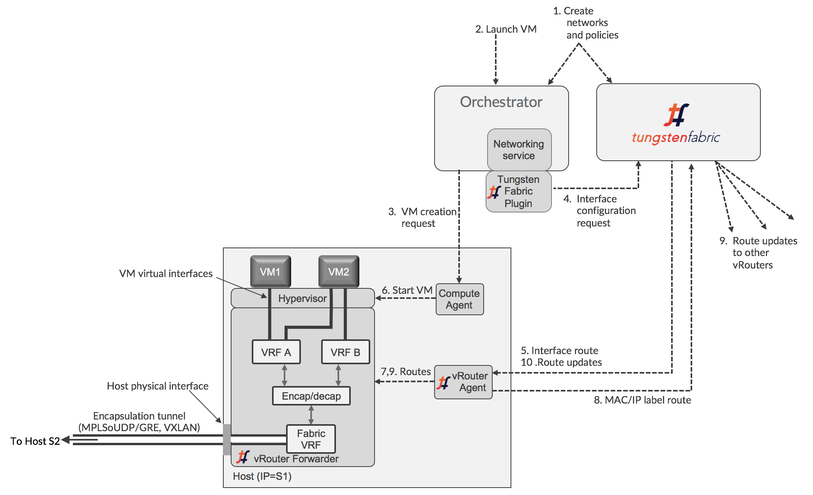

该图显示了一个协调器工作虚拟机管理程序和虚拟机，这和容器协调器的信息流类似，例如Kubernetes（参见XXX [带有Tungsten Fabric的Kubernetes容器]。主机上运行的工作负载的每个接口都连接到VRF包含相应网络的L2和L3转发表，其中包含该接口的IP地址。vRouter实现物理路由器执行的集成桥接和路由（IRB）功能。vRouter仅具有位于该主机上有网络接口的VRF，包括连接到主机物理接口的Fabric VRF。使用VRF可以使不同的虚拟网络具有重叠的IP和MAC地址，不会定义任何网络策略来允许它们之间的流量。Tungsten Fabric虚拟化网络使用封装隧道在不同主机上的VM之间传输封包，以及封装和解封装在Fabric VRF和VM VRF之间发生。这将在下一节中详细解释。

创建新的虚拟工作负载时，会在特定于orchestrator的插件中看到一个事件并将其发送到控制器，然后控制器会向代理发送请求以便在虚拟网络的VRF中安装路由，然后代理将其配置在转发器里。

使用单个接口在新VM上配置网络的逻辑流程如下：


1.  使用UI，CLI或北向REST API在Orchestrator或Tungsten Fabric中定义网络和网络策略。 网络主要定义为IP地址池，在创建VM时将分配给接口。
2.   用户请求由协调器启动VM，包括其接口所在的网络。
3.  协调器选择要运行的新VM的主机，并指示该主机上的计算代理程序获取其映像并启动VM。
4.  Tungsten Fabric插件从协调器的网络服务接收事件或API调用，指示它为将要启动的新VM的接口设置网络。 这些指令将转换为Tungsten Fabric REST调用并发送到Tungsten Fabric控制器。
5.  Tungsten Fabric控制器向vRouter代理发送请求，以便将新VM虚拟接口连接到指定的虚拟网络。 vRouter代理指示vRouter转发器将VM接口连接到虚拟网络的VRF。 如果不存在，则创建VRF，并且接口连接到它。
6.  计算代理启动VM，通常将其配置为使用DHCP为其每个接口请求IP地址。 vRouter代理DHCP请求，然后对接口IP地址，默认网关和DNS服务器地址进行响应。 
7.  一旦接口启动且具有来自DHCP的IP地址，vRouter安装到VM的IP和MAC地址路由，并将下一跳设为VM虚拟接口。
8.  vRouter为接口分配标签，并在MPLS表中安装标签路由。 vRouter向控制器发送XMPP消息，该消息包含到新VM的路由。该路由具有运行vRouter的服务器的IP地址的下一跳，并使用刚刚分配的标签指定封装协议。
9.  在网络策略所允许下，控制器将新VM路由分发到其他vRouters，包含VM位于同一网络和其他网络。
10.  在网络策略所允许下，控制器将其他VM的路由发送到新VM的vRouter。

在此过程结束时，已更新数据中心中所有vRouter的VRF中的路由已经有新VM的信息。


## vRouter架构解说 {#vrouter-details}

本节更详细地介绍了Tungsten Fabric vRouter的体系结构。 Tungsten Fabric vRouter的功能组件的概念视图如下所示。

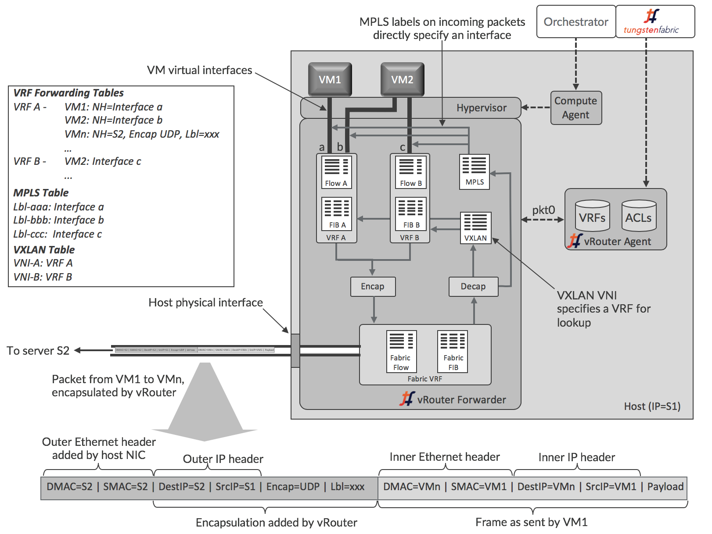

vRouter代理在主机操作系统的用户空间中运行，而转发器可以是内核模块，DPDK时在用户空间，或者在可编程网络接口卡（也称为“智能网卡”）中运行。这些选项在[vRouter的部署选项]部分中有更详细的描述。这里说明了更常用的内核模块模式。

代理与控制器保持会话，并发送有关其所需的VRF，路由和访问控制列表（ACL）的信息。代理将信息存储在自己的数据库中，并使用该信息配置转发器。接口连接到VRF，每个VRF中的转发信息库（FIB）配置转发条目。

每个VRF都有自己的转发表和流表，然而MPLS和VXLAN表在vRouter中是全局的。转发表包含目的地的IP和MAC地址的路由，并且IP到MAC关联用于提供代理ARP功能。当VM接口启动时，vRouter选择MPLS表中的标签值，并且仅对该vRouter本地有意义。 VXLAN网络标识符在Tungsten Fabric域内不同vRouters中的同一虚拟网络的所有VRF中是全局的。

每个虚拟网络都有一个分配给它的默认网关地址，每个虚拟机或容器接口在初始化时获得的DHCP响应中接收该地址。当工作负载将封包发送到其子网外的地址时，它将为与网关IP的IP地址对应的MAC进行ARP，并且vRouter以其自己的MAC地址进行响应。因此，vRouters支持所有虚拟网络的完全分布式默认网关功能。

### 详细的vRouter封包处理逻辑 {#packet-processing}

从VM流入VM并进入VM的封包的逻辑细节略有不同，并在以下两个图和描述中进行了描述。


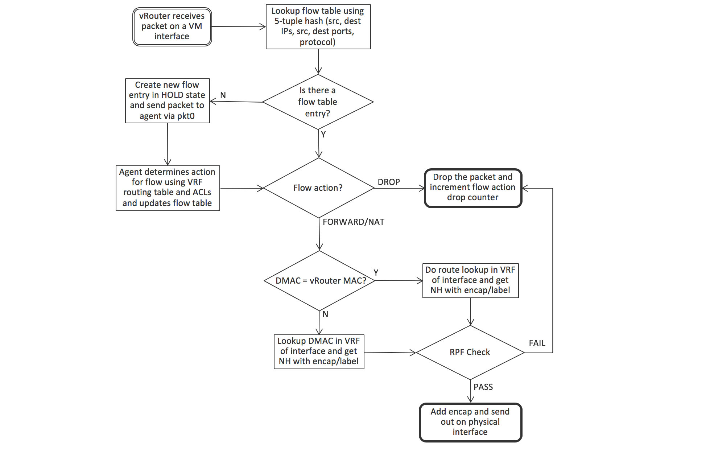

当从VM通过虚拟接口发送封包时，转发器接收该封包后首先检查接口所在的VRF流表中是否存在与封包的5元组匹配的条目（协议，源和目标IP地址，源和目标TCP或UDP端口）。如果这是流中的第一个封包，则不会有条目，转发器通过pkt0接口将封包发送给代理。代理根据VRF路由表和访问控制列表确定流的操作，并使用结果更新流表。动作可以是DROP，FORWARD，NAT或MIRROR。如果要转发封包，转发器将检查目标MAC地址是否是其自己的MAC地址，如果VM在目标位于VM的子网外时将封包发送到默认网关。在这种情况下，在IP转发表中查找目的地的下一跳，否则MAC地址用于查找。 vRouter在该计算节点内此处执行物理路由器的IRB（集成路由和桥接）功能。


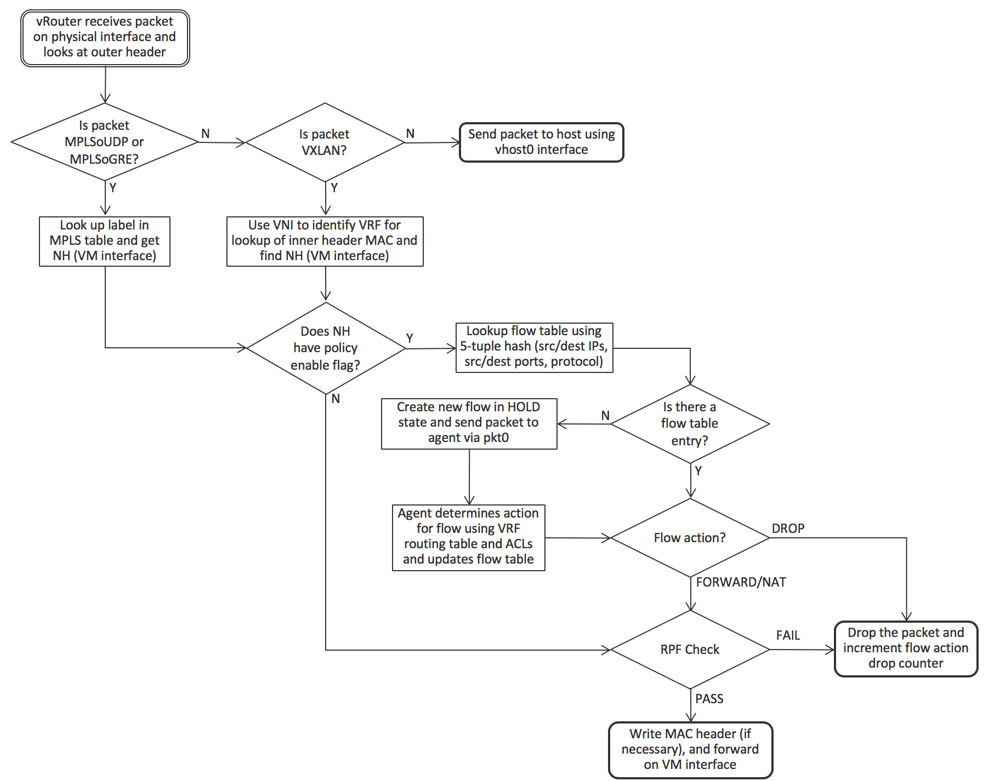

当封包从物理网络到达时，vRouter首先检查封包是否具有支持的封装。 如果不是，则将封包发送到主机操作系统。 对于基于UDP的MPLS和基于GRE的MPLS，标签直接标识VM接口，但VXLAN需要由VLAN网络标识符（VNI）标识的VRF中查找内部报头中的目标MAC地址。 一旦识别出接口，如果没有为接口设置策略标志（指示允许所有协议和所有TCP / UDP端口），则vRouter可以立即转发封包。否则，使用5元组来查找流表中的流，并使用与针对传出分组所描述的逻辑相同的逻辑。


### 相同子网虚拟机之间封包流 {#packet-flow-same-subnet}

VM中的应用程序首先将封包发送到另一个VM时发生的操作顺序如下图所示。 起点是两个VM都已启动，并且控制器已将L2（MAC）和L3（IP）路由发送到两个vRouters以启用VM之间的通信。 发送VM先前没有将数据发送到另一个VM，因此之前没有通过DNS解析目标名称。


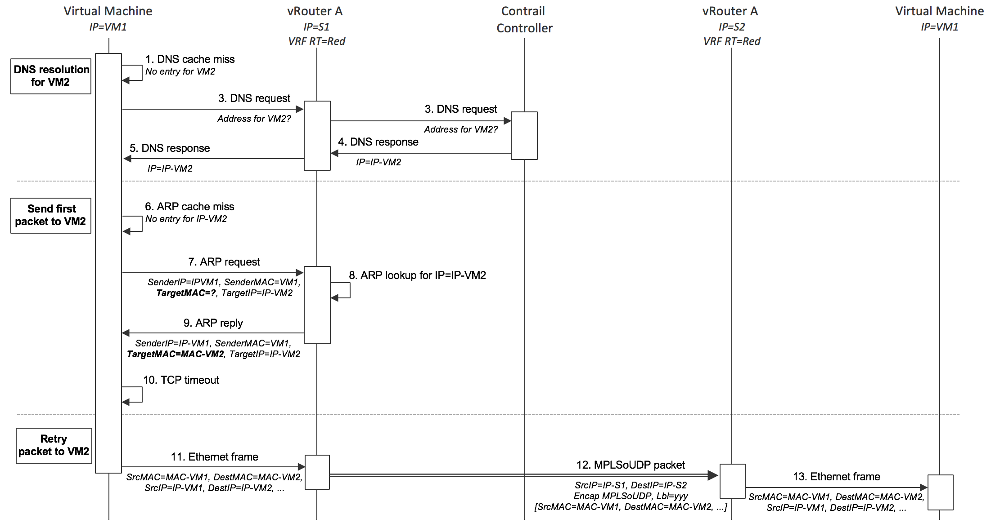


1.  VM1需要向VM2发送封包，因此首先查找自己的DNS缓存以获取IP地址，但由于这是第一个封包，因此没有条目。
2.  VM1在其接口出现时向DHCP响应中提供的DNS服务器地址发送DNS请求。 
3.  vRouter捕获DNS请求并将其转发到在Tungsten Fabric控制器中运行的DNS服务器。
4.  控制器中的DNS服务器以VM2的IP地址响应。
5.  vRouter将DNS响应发送给VM1。
6.  VM1需要形成以太网帧，因此需要VM2的MAC地址。 它会检查自己的ARP缓存，但没有条目，因为这是第一个封包。
7.  VM1发出ARP请求。
8.  vRouter捕获ARP请求并在其自己的转发表中查找IP-VM2的MAC地址，并在控制器为VM2发送的L2 / L3路由中找到关联。
9.  vRouter向VM1发送ARP回复，其MAC地址为VM2。
10.  VM1的网络堆栈中发生TCP超时。
11.  VM1的网络堆栈重试发送封包，这次在ARP缓存中找到VM2的MAC地址，并可以形成以太网帧并将其发送出去。
12.  vRouter查找VM2的MAC地址并找到封装路由。 vRouter构建外部头部并将结果封包发送到S2。
13.  S2上的vRouter解封装封包并查找MPLS标签以识别要将原始以太网帧发送到的虚拟接口。 以太网帧被发送到接口并由VM2接收。


### 不同子网虚拟机之间封包流 {#packet-flow-different-subnet}

将封包发送到不同子网中的目标时的顺序是相同的，只是vRouter作为默认网关响应。 VM1将在以太网帧中发送封包，其中包含默认网关的MAC地址，其IP地址是在VM1启动时vRouter提供的DHCP响应中提供的。 当VM1对网关IP地址发出ARP请求时，vRouter将使用自己的MAC地址进行响应。 当VM1使用该网关MAC地址发送以太网帧时，vRouter使用帧内封包的目的IP地址在VRF中查找转发表以查找路由，该路由将通过封装隧道连接到主机 目的地正在运行。


## Service Chains {#service-chains}

A service chain is formed when a network policy specifies that traffic between two networks has to flow through one or more network services, (e.g. firewall, TCP-proxy, load-balancer, …) , also termed Virtual Network Functions (VNF). The network services are implemented in VMs which are identified in Tungsten Fabric as services which are then included in policies. Tungsten Fabric supports service chains in both OpenStack and VMware vCenter environments. A simplified view of the routes that implement a service chain between two VMs is shown in below (in the actual Tungsten Fabric implementation, special "service" VRFs contain the routes through the service chain).


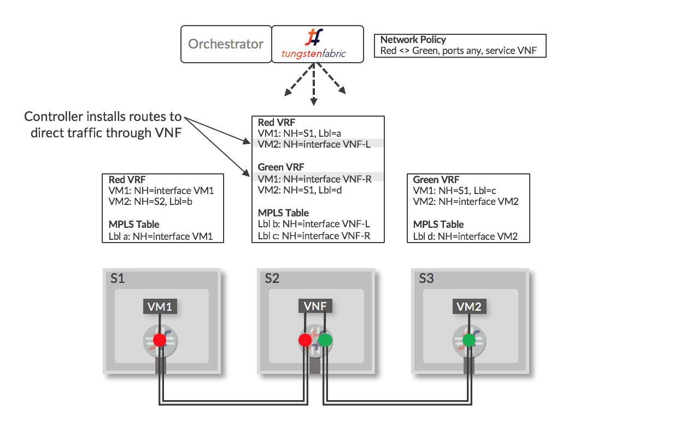


When a VM is configured in the controller to be a service instance (VNF), and the service is included in a network policy that is applied to networks the policy refers to, the controller installs routes in the VRFs of the "Left" and "Right" interfaces of the VNF that direct traffic through the VNF. When encapsulation routes are advertised by the VNF vRouter back to the controller, the routes are distributed to other vRouters that have Red and Green VRFs and the end result is a set of routes that direct traffic flowing between the Red and Green network to pass through the service instance. The labels "Left" and "Right" are used to identify interfaces based on the order that they become active when the VNF is booted. The VNF has to have a configuration that will process packets appropriately based on the interfaces that they will arrive on.

Services (VNFs) can be of three types:


*   _Layer 2 Transparent_ - Ethernet frames are sent into the service with the destination MAC address being that of the original destination (bump in the wire). This is most commonly used for deep packet inspection services.
*   _Layer 3 (In Network)_ - Frames are sent into the service with the destination MAC set to that of the ingress interface of the service, which terminates the L2 connection and sets up a new one using the egress MAC as the source MAC for frames sent to the destination. This is used for firewalls, load balancers and TCP proxies.
*   _Layer 3 (NAT)_ - Same as _In Network_, except that the service changes the source IP address to one that is routable from the destination (network address translation).

Various service chain scenarios are illustrated below, and a brief explanation each follows. 


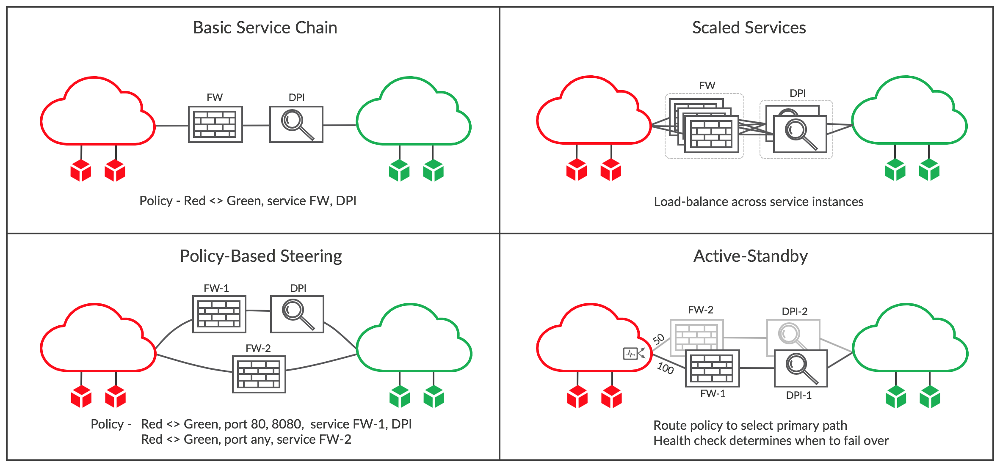


### Basic Service Chain {#basic-service-chain}

In the first panel, a simple service chain has been created by editing the network policy between the Red and Green networks to include the services FW and DPI. These are VMs that were previously started in OpenStack or vCenter and then configured in Tungsten Fabric to be service instances with interfaces in the Red and Green networks. When the policy is saved and is applied to the two networks, the routes in all the vRouters with Red or Green VMs attached are modified to send traffic via the service chain. For instance, prior to modifying the policy, each VRF in the Red network would have had a route to each VM in the Green network with a next hop of the host where the VM is running and a label that was specified the host vRouter and sent by the controller. The route is modified to have a next hop of the ingress VRF of the FW service instance, and the label that was specified for the FW left interface. The VRF with the right FW interface will have a routes for all Green destinations that point to the left interface of DPI, and the right VRF of DPI will contain routes for all Green destinations with next hop of the host where they are running and the original label. Routes for traffic in the reverse direction is similarly handled.


### Scaled-out Services {#scaled-out-service}

When a single VM does not have the capacity to handle the traffic requirements of a service chain, multiple VMs of the same type can be included in a service, as shown in the second panel. When this is done, traffic is load-balanced using ECMP across the ingress interfaces of the service chain at both ends, and is also load-balanced between layers of the chain.

New service instances can be added as needed in Tungsten Fabric, and although a traditional  ECMP hash algorithm implementation would normally move most sessions to other paths when the number of targets changes, in Tungsten Fabric this only happens for new flows, since the paths for existing flows are determined from the flow tables described in the section XXX _Detailed Packet Processing Logic In a vRouter_. This behavior is essential for stateful services that must see all packets in a flow, or else the flow will be blocked, resulting in a dropped user session. 

The flow tables are also populated to ensure that traffic for the reverse direction in a flow passes through the same service instance that it came from.

The internet draft at [https://datatracker.ietf.org/doc/draft-ietf-bess-service-chaining](https://datatracker.ietf.org/doc/draft-ietf-bess-service-chaining) contains more details on scaled out service chains with stateful services.


### Policy-based Steering {#policy-based-steering}

There are cases where traffic of different types needs to be passed into different services chains. This can be achieved in Tungsten Fabric by including multiple terms in a network or security policy. In the example in the diagram, traffic on ports 80 and 8080 have to pass through both a firewall (FW-1) and DPI, whereas all other traffic only passes through a firewall (FW-2), which may have a different configuration from FW-1. 


### Active-Standby Service Chains {#active-standby}

In some scenarios it is desirable for traffic to normally go through some specific service chain, but if there are issues detected with that chain, then traffic should be switched to a backup. This can be the case where the standby service chain is located in a less favorable geographic location.

Active-standby configuration is achieved in two steps in Tungsten Fabric. First a route policy is applied to the ingress of each service chain specifying a higher local preference value for the preferred active chain ingress. Secondly, a health check is attached to each chain that can test that service instances are reachable, or that a destination on the other side of the chain can be reached. If the health check fails, then the route to the normally active service chain is withdrawn and traffic will flow through the standby.


## Application-based Security Policies {#application-policies}

Conventional firewall policies contain rules based on individual IP addresses or subnet ranges. In data centers of any size this leads to a proliferation of firewall rules which are difficult to manage when being created and difficult to understand when troubleshooting. This is because the IP address of server or VM doesn't relate to the application, application owner, location or any other property. For instance, consider an enterprise that has two data centers and deploys a three tier application in development and production, as shown below.

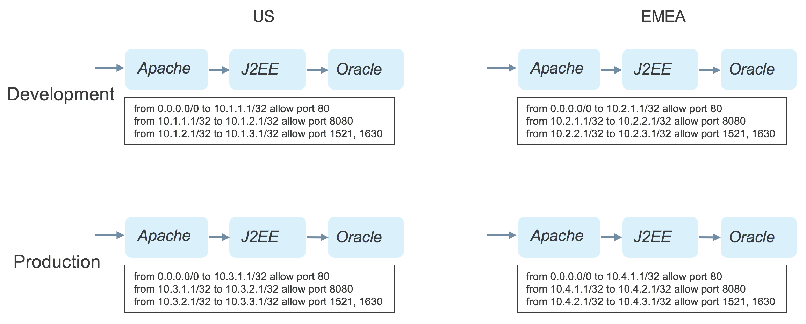


It is a requirement in this enterprise that the layers of each instance of an application can only communicate with the next layer in the same instance. This requires a separate policy for each of the application instances, as shown. When troubleshooting an issue, the admin must know the relation between IP addresses and application instances, and each time a new instance is deployed, a new firewall rule must be written.


### Application Tags {#tags}

The Tungsten Fabric controller supports security policies based on tags that can be applied to projects, networks, vRouters, VMs and interfaces. The tags propagate in the object model to all the objects contained in the object where the tag was applied, and tags applied at a lower level of the containment hierarchy take precedence over those applied at a higher level. Tags have a name and a value. A number of tag names are supplied as part of the Tungsten Fabric distribution. Typical uses for the tag types are shown in the table below:


<table>
  <tr>
   <td><strong>Tag Name</strong>
   </td>
   <td><strong>Typical Use</strong>
   </td>
   <td><strong>Examples</strong>
   </td>
  </tr>
  <tr>
   <td>application
   </td>
   <td>Identify a group of VMs that run a set of software instances of different types to support service accessed by end-users or other services. Can correspond to a Heat stack.
   </td>
   <td>LAMP stack, Hadoop cluster, set of NTP servers, Openstack/Tungsten Fabric cluster
   </td>
  </tr>
  <tr>
   <td>tier
   </td>
   <td>A set of software instances of the same type within an application stack that perform the same function. The number of such instances may be scaled according to performance requirements in different stacks.
   </td>
   <td>Apache web server, Oracle database server, Hadoop slave node, OpenStack service containers
   </td>
  </tr>
  <tr>
   <td>deployment
   </td>
   <td>Indicates the purpose of a set of VMs. Usually applies to all the VMs in a stack
   </td>
   <td>development, test, production
   </td>
  </tr>
  <tr>
   <td>site
   </td>
   <td>Indicates the location of a stack, usually at the granularity of data center.
   </td>
   <td>US East, London, Nevada-2
   </td>
  </tr>
  <tr>
   <td>custom
   </td>
   <td>New tags can be created as needed
   </td>
   <td>Instance name
   </td>
  </tr>
  <tr>
   <td>label
   </td>
   <td>Multiple labels can be applied to provide fine-grained control of data flows within and between stacks
   </td>
   <td>customer-access, finance-portal, db-client-access
   </td>
  </tr>
</table>


 

As shown in the table, in addition to the tag types that are provided with Tungsten Fabric, users can create their own custom tag names as needed, and there is a _label _type tag which can be used to more finely tune data flows.


### Creating an Application Policy {#creating-policy}

Application policies contain rules based on tag values and service groups, which are sets of TCP or UDP port numbers. First the security administrator allocates a tag of type _application _for the application stack, and assigns a tag of type _tier _for each software component of the application. This is illustrated below.


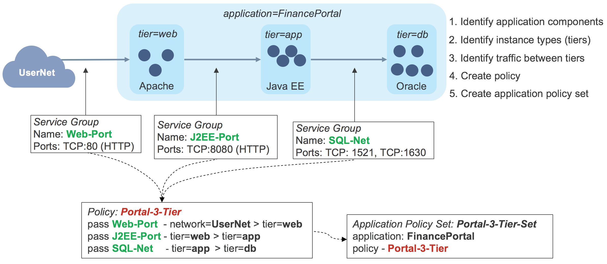

In this example, the application is tagged _FinancePortal _and the tiers are tagged _web, app _and _db._Service groups have been created for the traffic flows into the application stack and between each layer. The security administrator then creates an application policy, called _Portal-3-Tier _containing rules that will allow just the required traffic flows. An application policy set is then associated with the application tag _FinancePortal_ and contains the application policy _Portal-3-Tier. _At this point the an application stack can be launched and the tags applied to the various VMs in the Tungsten Fabric controller. This causes the controller to calculate which routes need to be sent to each vRouter to enforce the application policy set, and these are sent to each vRouter. If there is one instance of each software component, the routing tables in each vRouter would be as follows:


<table>
  <tr>
   <td><strong>Host</strong>
   </td>
   <td><strong>VRF</strong>
   </td>
   <td><strong>Source</strong>
   </td>
   <td><strong>Destination</strong>
   </td>
   <td><strong>Ports</strong>
   </td>
   <td><strong>Route</strong>
   </td>
  </tr>
  <tr>
   <td>S1
   </td>
   <td>Net-web
   </td>
   <td>0.0.0.0/0 \
10.1.1.3/32 \
10.1.1.3/32
   </td>
   <td>10.1.1.3/32 \
10.1.2.3/32 \
0.0.0.0/0
   </td>
   <td>80 \
8080 \
Any
   </td>
   <td>Interface for VM-web \
NH=S2, Lbl=10 \
Route to Internet
   </td>
  </tr>
  <tr>
   <td>S2
   </td>
   <td>Net-app
   </td>
   <td>10.1.1.3/32110.1.2.3/321010.1.2.3/32
   </td>
   <td>10.1.2.3/32 \
10.1.3.3/32 \
10.1.1.3/32
   </td>
   <td>8080 \
1521, 1630 \
1521, 1630
   </td>
   <td>Interface for VM-app \
NH=S3, Lbl=12 \
NH=S1, Lbl=5
   </td>
  </tr>
  <tr>
   <td>S2
   </td>
   <td>Net-db
   </td>
   <td>10.1.2.3/3210.1.3.3/32 
   </td>
   <td>10.1.3.3/32 \
10.1.2.3/32
   </td>
   <td>1521, 1630 \
1521, 1630
   </td>
   <td>Interface for VM-db \
NH=S3, Lbl=12 
   </td>
  </tr>
</table>


 

The networks and VMs are named here for the tier that they are in. In reality, the relationship between  entity names and tiers would not usually be as simple. As can be seen in the table, the routes enable traffic only as specified in the application policy, but here the tag based rules have been converted into network address-based firewall rules that the vRouter is able to apply.


### Controlling Flows Between Deployments {#flows-between-deployment}

Having successfully created an application stack, let's look at what happens when another deployment of the stack is created, as shown below.


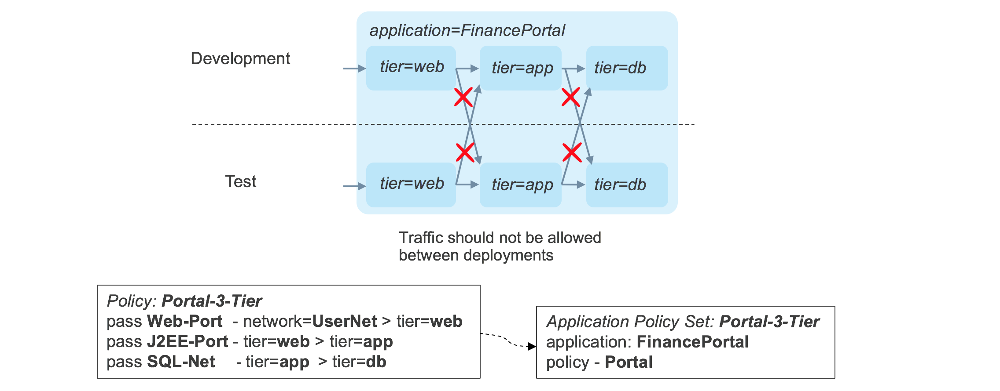

There is nothing in the original policy that prevents traffic flowing between a layer in one deployment into a layer in a different deployment. This behavior can be modified by tagging each component of each stack with a _deployment _tag, and by adding a _match _condition in the application policy to allow traffic to flow between tiers only when the deployment tags match. The updated policy is shown in below.


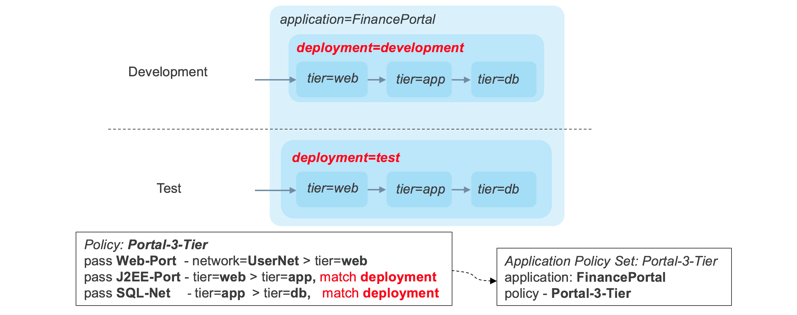

Now the traffic flows conform to the strict requirements that traffic only flows between components within the same stack.


### Advanced Application Policies {#advanced-policies}

Applying tags of different types allows the security policies to be applied in multiple dimensions, all in a single policy. For instance, in the diagram below, a single policy can segment traffic within individual stacks based on site, but allow sharing of the database tier within a site.


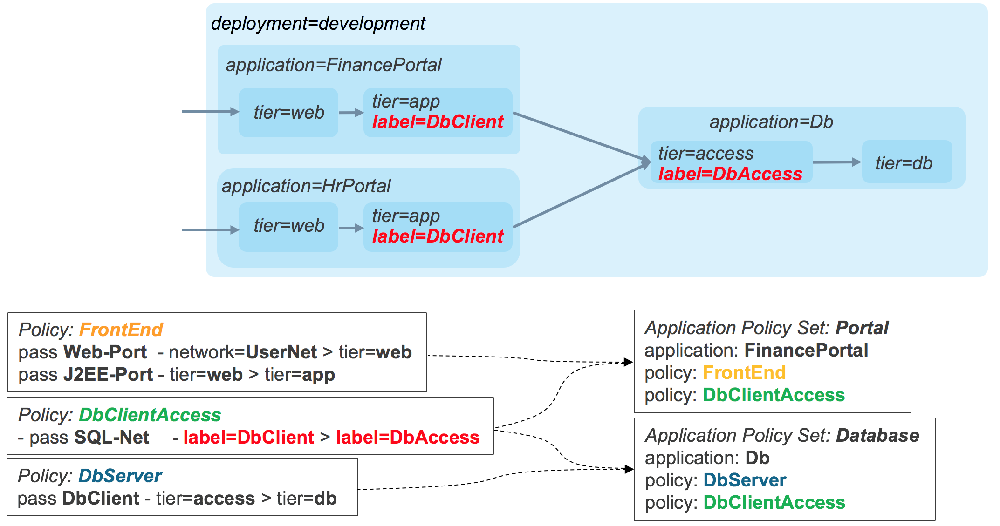


If multiple stacks are deployed within the same combination of sites and deployments, a custom tag for the instance name could be created and a match condition on the instance tag could be used to create the required restriction, as seen in the diagram, below.


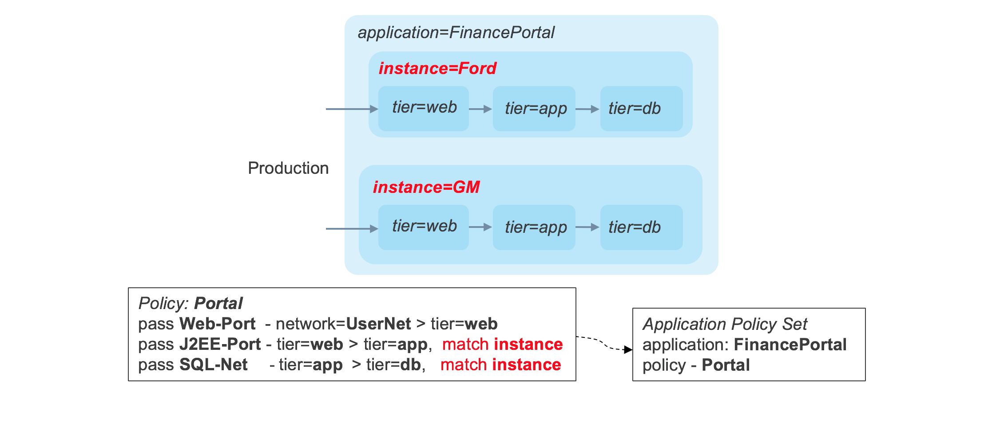


The application policy features in Tungsten Fabric provide a very powerful enforcement framework, while simultaneously enabling dramatic simplification of policies, and reduction in their number.


## Deployment Options for vRouter {#vrouter-deployment-options}

There are several deployment options for vRouter that offer different benefits and ease of use:


*   **Kernel Module**– This is the default deployment mode
*   **DPDK**– Forwarding acceleration is provided using an Intel library
*   **SR-IOV**– Provides direct access to NIC from a VM
*   **Smart NIC**– vRouter forwarder is implemented in a programmable NIC

These options are illustrated below.

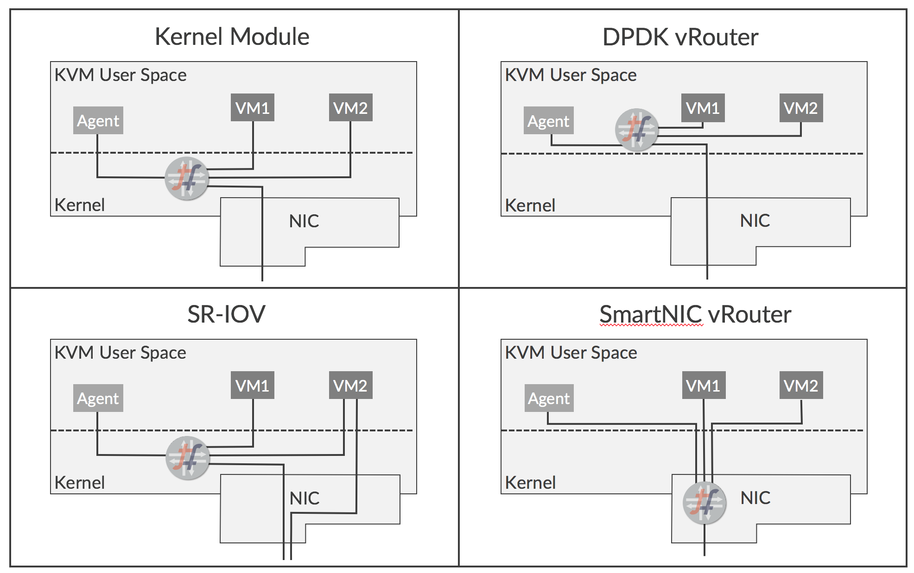

The features and benefits of each option are described below.


### Kernel Module vRouter {#kernel-module-vrouter}

The default deployment option today is for the vRouter forwarder to be implemented in a module that runs in the Linux kernel. The vRouter implements networking functionality that would otherwise be performed using iptables or Open vSwitch. Running in the kernel gives the forwarder direct access to network traffic as it passes through the network stack of KVM, and provides significant performance improvement over what can be achieved if the forwarder ran as a process in user space. Among the optimizations that have been implemented are:

*   TCP segmentation offload
*   Large receive offload
*   Use of multi-queue virtio packet processing

The kernel module approach allows users to implement network virtualization using Tungsten Fabric with minimal dependency on underlying server and NIC hardware. However, only specific Linux kernel versions are supported.


### DPDK vRouter {#dpdk-vrouter}

The Data Plane Development Kit (DPDK), from Intel, is a set of libraries and drivers that allow applications running in user space to have direct access to a NIC without going through the KVM network stack. A version of the vRouter forwarder is available that runs in user space and supports DPDK. The DPDK vRouter provides accelerated packet throughput compared to the kernel module with unmodified VMs, and even better performance can be achieved if the guest VMs also have DPDK enabled.

The DPDK vRouter works by dedicating CPU cores to packet forwarding which loop continuously waiting for packets. Not only are these cores not available for running guest VMs, as they are running at 100% continuously, and this can be an issue in some environments.


### SR-IOV (Single Root – Input/Output Virtualization) {#sriov-vrouter}

SR-IOV isn't strictly a deployment option for vRouter itself, but can be used with vRouter in some applications. SR-IOV allows the hardware resources of a NIC to be shared among multiple clients as if each has sole access, much like a hypervisor does for CPU. It gives a VM interface direct access to the NIC, so the data path bypasses the hypervisor networking stack, which leads to enhanced performance. SR-IOV can be useful when the VM is performing a gateway function between a physical network and virtual networks, but since SR-IOV involves bypassing the vRouter, the interfaces don't participate in Tungsten Fabric virtual networks and don't participate in network policies and network services.


### Smart NIC vRouter {#smartnic-vrouter}

Some new NICs are becoming available which are programmable. The Tungsten Fabric vRouter forwarder functionality can be implemented on these new NICs, and this brings substantial benefits in performance, particularly for small packet sizes which are dominant in some environments. Additionally, forwarding is almost completely offloaded from the x86 CPU of the server, so cores can be freed up for more VMs.

Smart NICs look very promising, but obviously require that the Smart NICs are available in production environments, and it will take time for them to become in widespread use.


## Tungsten Fabric Collection and Analytics {#tf-analytics}

Tungsten Fabric collects information from the cloud infrastructure (compute, network and storage) and the workloads running on it in order to facilitate operational monitoring, troubleshooting and capacity planning. The data is collected in a variety of formats such as syslogs, structured messages (known as Sandesh), Ipfix, Sflow and SNMP. Objects such as vRouters, physical hosts, virtual machines, interfaces, virtual networks and policies are modeled as User Visible Entities (UVEs) and the attributes for a UVE may come from a variety of sources in different formats.

The architecture for analytics collection is shown in the figure below.

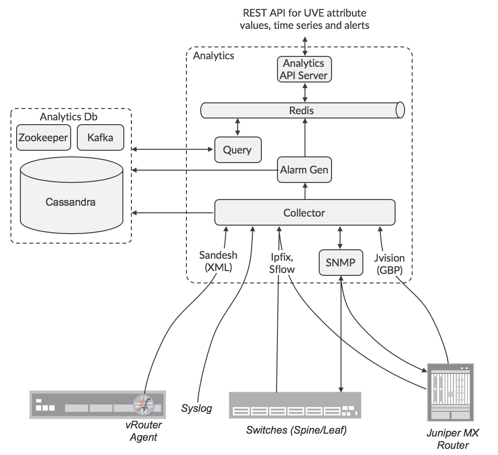

The data sources can be configured with the IP address of a destination collector, or there can be a load balancer for the collectors. The responsibility for SNMP polling is distributed across nodes by Zookeeper. The analytic nodes normalize incoming data to a common data format, then send it into a Cassandra database via the Kafka service. The API URL may be load-balanced using ha-proxy or some other load-balancer. The responsibility for collecting the data for UVEs is distributed among the Analytics nodes using Zookeeper, so API queries for UVE data are replicated by the receiving node to the other Analytics nodes, and the one(s) that hold data relating to the request will respond back to the original node, which will collate the responses into the payload that the requestor will receive. Responsibility for alarm generation is also distributed across nodes, so the Alarm Generation function subscribes to the Kafka buses in Analyticsdb nodes in order to observe the data needed to calculate if an alarm condition is met, since this data may be collected by other nodes. The UVEs are hashed across a number of Kafka topics, which are distributed among Alarm Gen functions in order to spread the load effectively.


## Tungsten Fabric Deployment {#tf-deployment}

The latest versions of Tungsten Fabric (5.0 and later) use a microservices architecture based on Docker containers. The microservices are grouped into _pods_, which correspond to roles that are assigned to servers during deployment. The relationship of microservices to pods is shown in the diagram, below.


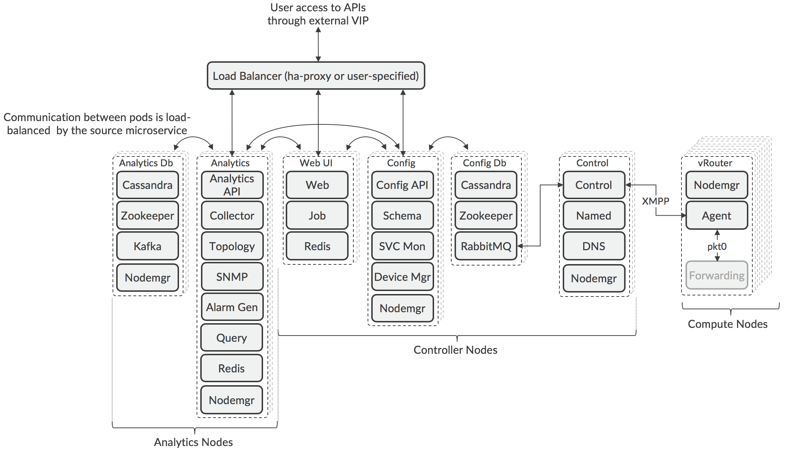


The architecture is composable, meaning that each Tungsten Fabric role can be separately scaled using multiple pods running on different servers to support the resilience and performance requirements of a particular deployment. Due to the nature of the algorithm in Zookeeper for choosing the active node, the number of pods deployed in the Controller and Analytic nodes must be an odd number, but this can vary between pod types. The nodes are logical groupings whose pods may be deployed on different servers, and a server can run pods from different node types. 

The API and Web GUI services are accessed through a load balancer that is deployed during Contrail installation, or through a third-party load balancer has been configured for this purpose. Use of a third-party load balancer can allow pods to be in different subnets, which is a common scenario when pods need to be placed in different racks in a datacenter for resilience.

The Control pods are scaled according to the number of compute nodes in the cluster with a maximum of 1000 nodes per control node. Additional control nodes may be deployed in certain use cases where compute nodes are deployed in points-of-presence remotely from the controller nodes.

The number of compute nodes is scaled according the the needs of the workloads that are anticipated to be deployed by the orchestrator. Within a compute node, the Forwarder function is not implemented as a container (see XXX [Deployment Options for vRouter]

The layout of Tungsten Fabric services across servers is controlled by configuration files that are read by the deployment tool, which can be Ansible (using playbooks) or Helm (using charts). Example playbooks and charts are available that cover simple all-in-one deployments where all the services run in the same VM, to high-availability examples involving multiple VMs or bare metal servers. Examples are also provided where the orchestrator and Tungsten Fabric are running in a public cloud (e.g. Amazon Web Services, Google Cloud Engine, Microsoft Azure) and the workloads are also running there.

More details on deployment tools and how to use them can be found at the Tungsten Fabric website ([www.tungsten.io](http://www.tungsten.io/)).


## Tungsten Fabric APIs {#tf-apis}

Tungsten Fabric supports the following APIs:


*   REST API for controller configuration
*   Python bindings that map to the REST configuration API
*   REST API for access to analytics data

This are described in more detail in the following sections.


### Controller Configuration REST API {#tf-rest-apis}

All configuration for a Tungsten Fabric cluster is available through a REST API that is accessed on port 8082 of the Tungsten Fabric external virtual IP address. Users can use HTTP GET calls to retrieve lists of resources or the details of their properties. Data is returned as a JSON object.

Changes can be made to the Tungsten Fabric object model (e.g. add virtual network, create service chain) by sending HTTP POST commands that contain a JSON representation of the attributes of the new object.

The REST API is automatically generated from the data model schema file when Tungsten Fabric is compiled and built.


### Python Bindings {#tf-python}

Also generated automatically during compilation are a set of Python bindings that map to the REST API.

In a Python session or script, a session is opened as follows:

`from vnc_api import vnc_api \
 \
vnc = vnc_api.VncApi( \
        username = "admin", \
        password = "<password>", \
        tenant_name = "admin", \
        api_server_host = "10.1.1.1", \
        auth_host = "10.1.1.2")` \


And a virtual network could be created using:


```
tenant = vnc.project_read(fq_name = ['default-domain', tenant_name])
vn = vnc_api.VirtualNetwork(name = name, parent_obj = tenant)
ipam = vnc.network_ipam_read(
        fq_name = ['default-domain', tenant_name, ipam_name])
prefix, prefix_len = cidr.split('/')
subnet = vnc_api.SubnetType(
        ip_prefix = prefix, ip_prefix_len = prefix_len)
ipam_subnet = vnc_api.IpamSubnetType(subnet = subnet)
vn.set_network_ipam(
        ref_obj = ipam,
        ref_data = vnc_api.VnSubnetsType([ipam_subnet]))
vnc.virtual_network_create(vn)
```


The Python binding is generally easier to use than the REST API, since it does not require usage of a JSON payload.


### Analytics REST API {#tf-analytics-rest-api}

The analytics data collected in Tungsten Fabric can be accessed through a REST API on port 8082 of the Tungsten Fabric external virtual IP address. Configuration and operational information is organized in objects known as _User Visible Entities_ (UVEs) which can contain attributes that are aggregated from a number of Tungsten Fabric components. For instance, the operational information for a virtual network might have come from vRouters, configuration pods and control pods. Output from the Analytics API is in the form of JSON payloads. UVE data is retrieved with a direct URL to the location of the data.

HTTP GET queries are used to retrieve lists of tables within the analytics database and to obtain their APIs and schemas.

HTTP POST queries are used to retrieve time series data stored in a table. The POST queries include a JSON formatted version of an SQL query that specifies the table, fields and _where_ condition to match against. The Analytics API includes an additional feature allowing the specification of a start time and end time for retrieved data.

The Analytics API can be used to configure and retrieve alarms based on threshold crossing events for any time series stored in the analytics database.

Server-sent event (SSE) streams can be configured for for any UVE or alarm in the analytics database.


## Orchestrators {#tf-orchestrators}

The following section describe how Tungsten Fabric provides virtual networking for a variety of orchestrators:


*   OpenStack
*   Kubernetes
*   VMware vCenter


### OpenStack with Tungsten Fabric {#tf-openstack}

OpenStack is the leading open-source orchestration system for virtual machines and containers. Tungsten Fabric provides an implementation of its Neutron networking service, and provides many additional capabilities as well. In OpenStack, groups of users are assigned to "projects" within which resources such as VMs and networks are private and can't be seen by users in other projects (unless this is specifically enabled). The use of VRFs in vRouters, with their per-network routing tables, makes the enforcement of project isolation in the network layer straight-forward, since only routes to allowed destinations are distributed to VRFs in vRouters on compute nodes and no flooding occurs due to the proxy services that vRouter performs.

In the diagram in XXX, the networking service is Neutron and the compute agent is Nova (the OpenStack compute service).

Tungsten Fabric can provide seamless networking between VMs and Docker containers when both are deployed in an OpenStack environment.

In the diagram below, it can be seen that the Tungsten Fabric plug-in for OpenStack provides a mapping from the Neutron networking API to Tungsten Fabric API calls that are performed in the Tungsten Fabric controller.


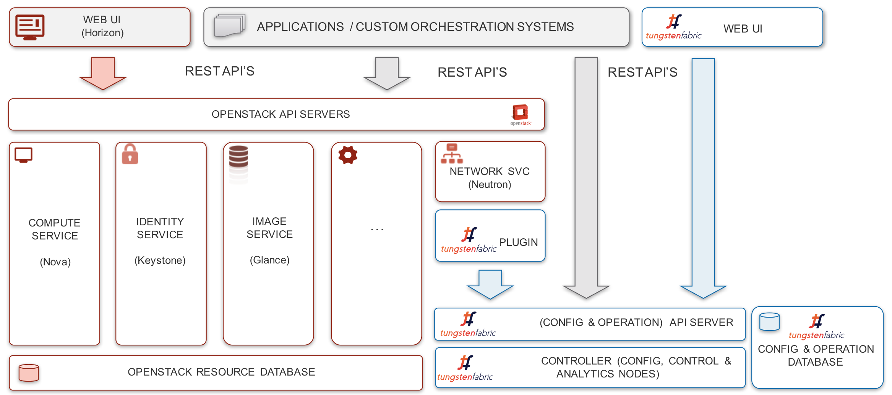


Tungsten Fabric supports definition of networks and subnetworks, plus OpenStack network policies and security groups. These entities can be created in either OpenStack or Tungsten Fabric and any changes are synchronized between the two systems. Additionally, Tungsten Fabric supports the OpenStack LBaaS v2 API. However, since Tungsten Fabric provides a rich superset of networking features over OpenStack, many networking features are only available via the Tungsten Fabric API or GUI. These include assigning route targets to enable connectivity to external routers, service chaining, configuring BGP route policies and application policies. 

Application security, as described in the section XXX, is fully supported when OpenStack uses Tungsten Fabric networking. Tungsten Fabric tags can be applied at the project, network, host, VM or interface levels, and propagate to be applied to all entities that are contained in the object that a tag is applied to.

Additionally, Tungsten Fabric supports a set of resources for networking and security that can be controlled using OpenStack Heat templates.


### Kubernetes Containers with Tungsten Fabric {#tf-kubernetes}

Containers allow multiple processes to run on the same operating system kernel, but with each having access to its own tools, libraries and configuration files. Containers require less compute overhead than virtual machines where each VM runs its own complete guest operating system. Applications running in containers will generally start up much faster, and perform better than the same application running in a VM, and this is one of the reasons why there is growing interest in using containers in datacenters and for NFV.  Docker is a software layer that enables containers to be portable across operating system versions and is the typical Container Runtime Interface used by Kubernetes deployments as a shim layer to manage creation and destruction of containers on servers.


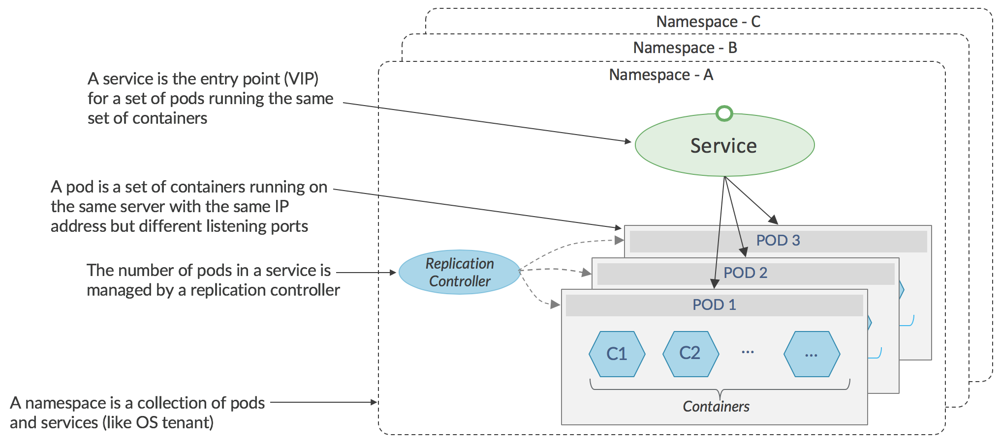


As seen in the diagram, above, Kubernetes manages groups of containers, that together perform some function, and are called _pods._The containers in a pod run on the same server and share an IP address. Sets of identical pods (generally running on different servers) form _services _and network traffic destined for a service has to be directed to a specific pod within a service. In the stock Kubernetes networking implementation, selection of a specific pod is performed either by the application itself using a native Kubernetes API in the sending pod, or, for non-native applications, by a load-balancing proxy using a virtual IP address implemented in Linux iptables on the sending server. The majority of applications are non-native, since they are ports of existing code that was not developed with Kubernetes in mind, and therefore the load-balancing proxy is used.

The standard networking in a Kubernetes environment is effectively flat, with any pod able to communicate with any other pod. Communication from a pod in one namespace (similar to a _project _in OpenStack) to a pod in another namespace is not prevented if the name of target pod, or its IP address is known. While this model is appropriate in hyperscale data centers belonging to a single company, it is unsuitable for service providers whose data centers are shared among many end-customers, or in enterprises where traffic for different groups must be isolated from each other.

Tungsten Fabric virtual networking can be integrated in a Kubernetes environment to provide a range of multi-tenant networking features in similar fashion as with OpenStack. 

This configuration of Tungsten Fabric with Kubernetes is shown below.


 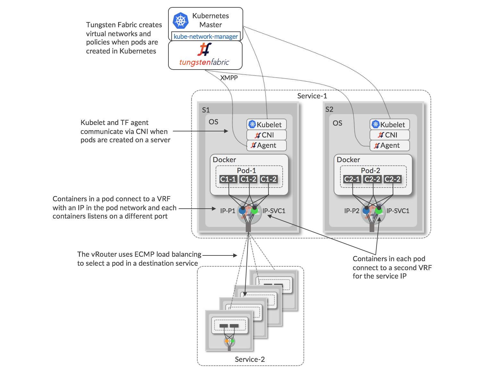


The architecture for Tungsten Fabric with Kubernetes orchestration and Docker containers is similar to OpenStack and KVM/QEMU, with the vRouter running in the host Linux OS and containing VRFs with virtual network forwarding tables. All containers in a pod share a networking stack with a single IP address (IP-1, IP-2 in the diagram), but listen on different TCP or UDP ports, and the interface of each networking stack is connected to a VRF at the vRouter. A process called _kube-network-manager _listens for network-related messages using the Kubernetes _k8s _API and sends these into the Tungsten Fabric API. When a pod is created on a server, there is communication between the local _kubelet _and the vRouter agent via the Container Network Interface (CNI) to connect the new interfaces into the correct VRFs. Each pod in a service is allocated a unique IP addresses within a virtual network, and also a floating IP address which is the same for all the pods in a service. The service address is used to send traffic into the service from pods in other services, or from external clients or servers. When traffic is sent from a pod to a service IP, the vRouter attached to that pod performs ECMP load-balancing using the routes to the service IP address that resolve to the interfaces of the individual pods that form the destination service. 

When traffic needs to sent to a service IP from outside the Kubernetes cluster, Tungsten Fabric can be configured to create a pair (for redundancy) of _ha-proxy_ load balancers which can perform URL-based routing to Kubernetes services, preferably using floating IP addresses to avoid exposing the internal IP addresses of the cluster. These externally visible service addresses resolve to ECMP load balanced routes to pods of the service. Kubernetes proxy load-balancing is not needed when Tungsten Fabric virtual networking is used in a Kubernetes cluster. 

Other alternatives for providing external access include: using a floating IP address which is associated with a load balancer object, or using a floating IP address associated with the service.

When services and pods are created or deleted in Kubernetes, the kube-network-manager process detects corresponding events in the k8s API, and it uses the Tungsten Fabric API to apply network policy according to the network mode that has been configured for the Kubernetes cluster. The various options are summarized in the following table.


<table>
  <tr>
   <td><strong>Networking Mode</strong>
   </td>
   <td><strong>Network Policy</strong>
   </td>
   <td><strong>Effect</strong>
   </td>
  </tr>
  <tr>
   <td>Kubernetes default
   </td>
   <td>Any-to-any, no tenant isolation
   </td>
   <td>Any container can talk to any other container or service
   </td>
  </tr>
  <tr>
   <td>Namespace isolation
   </td>
   <td>Kubernetes <em>namespaces </em>map to <em>projects</em> in Tungsten Fabric
   </td>
   <td>Containers within a namespace can communicate with each other
   </td>
  </tr>
  <tr>
   <td>Service isolation
   </td>
   <td>Each pod is in its own virtual network and security policy is applied so that only the service IP address is accessible from outside the pod
   </td>
   <td>Communication within a pod is enabled, but only the service IP address is accessible from outside a pod
   </td>
  </tr>
  <tr>
   <td>Container isolation
   </td>
   <td>Zero-trust between containers in the same pod. 
   </td>
   <td>Only specifically allowed communications between containers are enabled, even within a pod. Only specific pod to specific services may be enabled.
   </td>
  </tr>
</table>


 

Tungsten Fabric brings many powerful networking features to the Kubernetes world, in the same way that it does for OpenStack, including:


*   IP address management 
*   DHCP
*   DNS
*   Load balancing
*   Network address translation (1:1 floating IPs and N:1 SNAT)
*   Access control lists
*   Application-based security


### Tungsten Fabric and VMware vCenter {#tf-vcenter}

VMware vCenter is in widespread use as a virtualization platform, but requires manual configuration of a network gateway in order to achieve networking between virtual machines that are in different subnets and with destinations external to a vCenter cluster. Tungsten Fabric virtual networking can be deployed in an existing vCenter environment to provide all the networking features that were listed previously, while preserving the workflows that users may have come to rely on to create and managed virtual machines using the vCenter GUI and API. Additionally, support has been implemented for Tungsten Fabric in vRealize Orchestrator and vRealize Automation so that common tasks in Tungsten Fabric such as creation of virtual networks and network policies can be included in workflows implemented in those tools.

The architecture for Tungsten Fabric working with VMware vCenter is shown in the diagram, below.


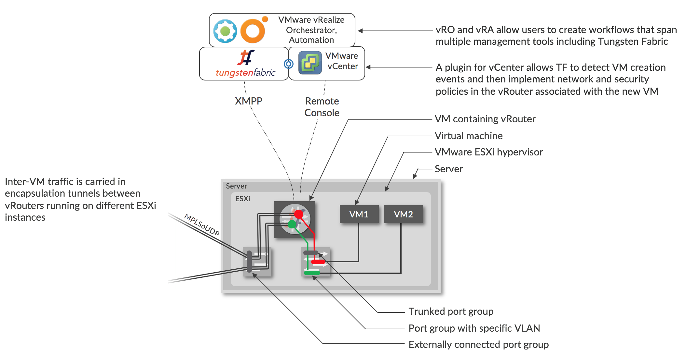


Virtual networks and policies are created in Tungsten Fabric, either directly, or using TF tasks in vRO/vRA workflows. 

When a VM is created by vCenter, using its GUI or via vRO/vRA, the vCenter plugin for Tungsten Fabric will see a corresponding message on the vCenter message bus, and this is the trigger for Tungsten Fabric to configure the vRouter on the server that the VM will be created on. Each interface of each VM is connected to a port group that corresponds to the virtual network that the interface is in. The port group has a VLAN associated with it that is set by the Tungsten Fabric controller using the "VLAN override" option in vCenter, and all the VLANs for the port groups are sent through a trunked port group into the vRouter. The Tungsten Fabric controller maps between the VLAN of a interface to the VRF of the virtual network that contains that subnet. The VLAN tag is stripped, and route look up in the VRF is performed as described in the section XXX


Using Tungsten Fabric with vCenter gives users access to the full range of network and security services that Tungsten Fabric offers as described in earlier in this document, including zero-trust micro-segmentation, proxy DHCP, DNS and DHCP which avoids network flooding, easy service chaining, almost unlimited scale, and seamless interconnection with physical networks.


### Nested Kubernetes with OpenStack or vCenter {#tf-nested-kubernetes}

In the previous section, the it was assumed that the KVM hosts where the containers run had been provisioned beforehand by some means. An alternative is to use OpenStack or vCenter to provision VMs in which the containers run, and for Tungsten Fabric to manage virtual networking between VMs created by OpenStack or vCenter and containers created by Kubernetes. This is illustrated below.


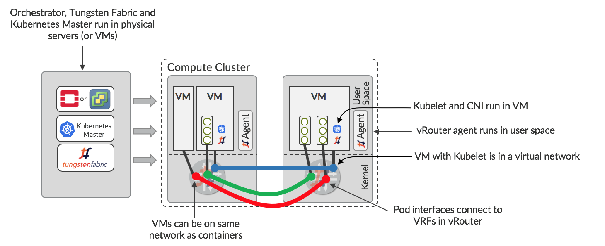


The orchestrator (OpenStack or vCenter), Kubernetes Master and Tungsten Fabric are running in a set of servers or VMs. The orchestrator is configured to manage the compute cluster with Tungsten Fabric, so there are vRouters on each server. VMs can be spun up and configured to run Kubelet and the CNI plugin for Tungsten Fabric. These VMs become available for the Kubernetes master to run containers in, with networking managed by Tungsten Fabric. Since the same Tungsten Fabric is managing the networks for both the orchestrator and Kubernetes, seamless networking is possible between VMs, between containers, and between VMs and containers.

In the nested configuration, Tungsten Fabric delivers the same levels of isolation as described previously, and it is possible for multiple Kubernetes Masters to co-exist and for multiple VMs running Kubelet to run on the same host. This allows a multi-tenant Kubernetes container service to be offered.


## Connecting to Physical Networks {#tf-physical}

In any datacenter, there is a need for some VMs to access external IP addresses, and for users outside the datacenter to access some VMs via public IP addresses. Tungsten Fabric provides several ways to achieve this:


*   VPN connection to a BGP-enabled gateway
*   Source NAT in the vRouter
*   Local gateway in the vRouter to the underlay fabric

Each of these is applicable in different use cases, and have varying dependencies on configuration of external devices and networks.

The methods of connection to external networks are described in the following sections.


### BGP-Enabled Gateway {#tf-bgp-gateway}

One way of achieving external connectivity is to create a virtual network using a range of externally routable IP addresses, and to extend the network to a gateway router. When the gateway router is a Juniper MX router, the configuration on the device can be done automatically by Tungsten Fabric. This is illustrated below.


 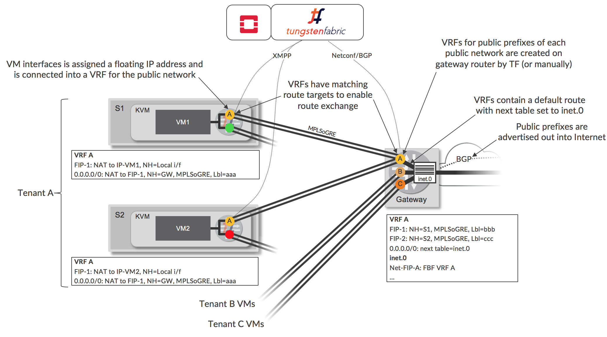

Network A is defined in Tungsten Fabric, and contains a subnet of publicly addressable IP addresses. This public virtual network is configured in Tungsten Fabric to extend to the gateway router, which, when using Tungsten Fabric Device Manager results in automatic creation of a VRF on the gateway with route target matching that of the virtual network (e.g. VRF labeled A). Tungsten Fabric configures this VRF with a default route that causes route lookup for traffic arriving in the VRF from the Tungsten Fabric cluster to occur in the main inet.0 routing table (which will contain routes to public destinations in the Internet). A forwarding filter is installed, which causes traffic arriving at the gateway with destinations in the Network A to be looked up in the VRF that Tungsten Fabric created. The router advertises a default route via the VRF to the Tungsten Fabric controller.

Network A is configured to be a floating IP address pool in Tungsten Fabric, and when such an address is assigned to an existing VM interface, an additional VRF (e.g. for Network A) is created in the vRouter for the VM, and the interface is connected to the new, public VRF, in addition to being connected to the original VRF (green or red in Figure 6). VRFs for floating IP addresses perform 1:1 NAT between the floating IP address and the IP address configured on the VM. The VM is unaware of this additional connection and continues to send and receive traffic using the address for its original virtual network that it received via DHCP. The vRouter advertises a route to the floating IP address to the controller, and this route is sent to the gateway via BGP and it is installed in the public VRF (e.g. VRF A). The Tungsten Fabric controller sends the vRouter a default route via the VRF on the physical router and this is installed in vRouter's public VRF. 

The result of these actions is that the public VRFs on vRouters contain a route to a floating IP address via a local interface of a VM, and a default route via a VRF on the router. The VRFs on the gateway have a default route (implemented using filter-based forwarding) via the inet.0 route table, and have host routes to each allocated floating IP address. The inet.0 route table has routes to each floating IP network via the corresponding VRF.

Multiple separate public subnets can be used as separate floating IP address pools with their own VRFs when tenants own their own public IP address ranges (as shown in the diagram), and conversely, one floating IP address pool can be shared among multiple tenants (not shown).

In cases where a non-Juniper device is used, or Tungsten Fabric is not permitted to make configuration changes on the gateway, a BGP session, public network prefix and static routes can be set up on the gateway manually, or by a configuration tool. This method is used when the router is combining a provider edge (PE) router role for enterprise VPNs with a datacenter gateway role. Generally, in this case, the VRFs will created by a VPN management system. A virtual network in the Tungsten Fabric cluster will be connected into an enterprise VPN when a matching route target is configured in the virtual network, and routes are exchanged between the controller and the gateway/PE.


### Source NAT {#tf-source-nat}

Tungsten Fabric enables networks to be connected via  a Source-based NAT service which allows multiple VMs or containers to share the same external IP address. Source NAT is implemented as a distributed service in each vRouter. The next hop for traffic being sent from a VM to the Internet will be the SNAT service in the same vRouter, and it will forward to the gateway of the underlay network without encapsulation, with source address modified to that of the vRouter host and setting source port to be specific to the sending VM. The vRouter uses the destination port in returning packets to map back to the originating VM.

This option is useful for providing internet access for workloads where the actual IP address of the source does not need to be known by the destination (which is usually the case).


### Routing in Underlay {#tf-underlay-routing}

Tungsten Fabric allows networks to be created that use the underlay for connectivity. In the case that the underlay is a routed IP fabric, the Tungsten Fabric controller is configured to exchange routes with the underlay switches. This allows virtual workloads to connect to any destination reachable from the underlay network and provides a much simpler way than a physical gateway to connect virtual workloads to external networks. Care must be taken that overlapping IP address are not connected into the fabric, so this feature is more useful for enterprises connecting cloud to legacy resources rather than multi-tenant service providers. 

Note that the traffic flowing to and from the underlay network is subject to network and security policy enforcement just as it is for traffic between workloads using virtual networks.


<!-- GD2md-html version 1.0β13 -->
