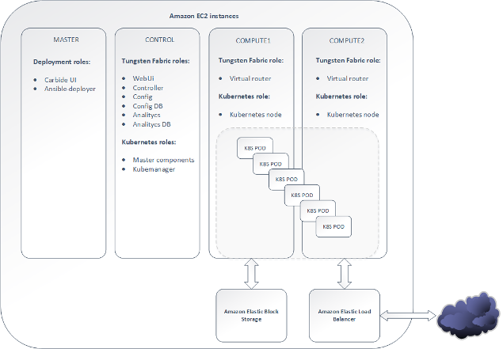
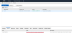
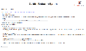
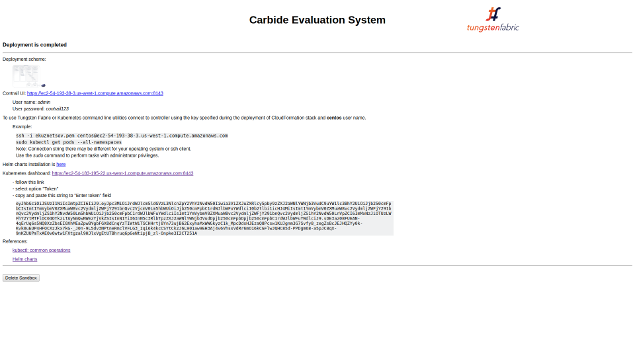

## Introduction

This document contains instructions how to deploy a sandbox with Tungsten Fabric cluster orchestrated by Kubernetes in AWS. The Tungsten Fabric cluster is composed of deployment node, one controller and two compute nodes that run as EC2 VMs.

[  ](images/carbide_deployment.png)

## Requirements

It is necessary to subscribe to the official image of CentOS 7 x86_64 HVM before you start using the sandbox.

Selected Region must have at least two Availability Zones.

Once you have signed into the AWS console, go to the following URL: <a href="https://aws.amazon.com/marketplace/pp/B00O7WM7QW/" target="_blank">AWS Marketplace</a>

Press "Continue to Subscribe", then "Accept Terms".

*If you are connected as an IAM user, and you can not perform a task in AWS Marketplace, check the Appendix at the end of the document for the instructions.

## Procedure

1. Just click on this button to create the sandbox (run as AWS CloudFormation stack) :

<a href="https://console.aws.amazon.com/cloudformation/home#/stacks/new?stackName=tungstenfabric-k8s&amp;templateURL=https://s3-us-west-2.amazonaws.com/tungsten-fabric-sandbox/tungsten_fabric_stack_template.yaml" target="_blank"></a>

2. Press Next.
3. Specify:
 * Your admin password for Sandbox UI
 * <a href="https://aws.amazon.com/ec2/instance-types" target="_blank">EC2 Instance type</a>
 * <a href="https://docs.aws.amazon.com/AWSEC2/latest/UserGuide/ec2-key-pairs.html" target="_blank">Key Pair</a> (required to access command-line utilities)
4. Press Next twice.
5. Set checkbox "Acknowledge..." at the bottom of the page.
6. Press Create.
7. Reload Stacks page and wait for Stack CREATE_COMPLETE status.
8. Select the Stack (checkbox) and check "Output" tab in the bottom pane to find Sandbox UI URL.

[  ](images/status_stack_full.png)

9. Go to Sandbox UI URL and wait for the deployment (site will be available in 2-3 minutes after the creation of the stack).
10. After a successful deployment, the sandbox interface will provide information to connect to Tungsten Fabric and Kubernetes services.
11. Use Tungsten Fabric UI URLs, login and password to start.

IMPORTANT: When you've finished using the sandbox you can use the DELETE SANDBOX button to clear all of the used resources.

[  ](images/delete_stack_full.png)

For double safety you can check the remaining resources in the AWS Interface after deleting.

## Accessing the cluster:

You can use the ssh key specified during the launch of the stack to access any VM with the "centos" username.

```
ssh -i <ssh-key name> centos@<ip>   # <ip> can be the public IP or the private IP of the node
sudo -s
```
The sandbox interface will provide information about how to connect to Tungsten Fabric UI and Kubernetes dashboard.

[  ](images/carbide_ui_full.png)


## Appendix: IAM Users

You need to grant additional privileges for the user if instead of using a root account you are signing with an IAM user.

- Log on to the AWS console.
- In the AWS services search at the top left of the console look for IAM and select it.
- On the left navigation bar click on the user whose privileges you need to change.
- At the right bottom click Add inline policy.
- Go to the JSON tab and replace the content with the following policy:

```
{
    "Version": "2012-10-17",
    "Statement": [
        {
            "Effect": "Allow",
            "Action": [
                "cloudformation:*",
                "aws-marketplace:*",
                "sns:*",
                "s3:*",
                "ec2:*",
                "elasticloadbalancing:*",
                "cloudwatch:*",
                "autoscaling:*",
                "iam:*"
            ],
            "Resource": "*"
        }
    ]
}
```

- Review policy. Add policy name. Create policy.

## Get to know Tungsten Fabric more

[All about Tungsten Fabric](https://www.juniper.net/documentation/en_US/release-independent/contrail/information-products/pathway-pages/index.html)

[Tungsten Fabric and Kubernetes Intro](https://github.com/Juniper/contrail-controller/wiki/Kubernetes)

[Install Kubernetes using Kubeadm](https://github.com/Juniper/contrail-controller/wiki/Install-K8s-using-Kubeadm)

[Deploy Tungsten Fabric on Kubernetes in 1-step command](Tungsten-Fabric-one-line-install-on-k8s.md)


